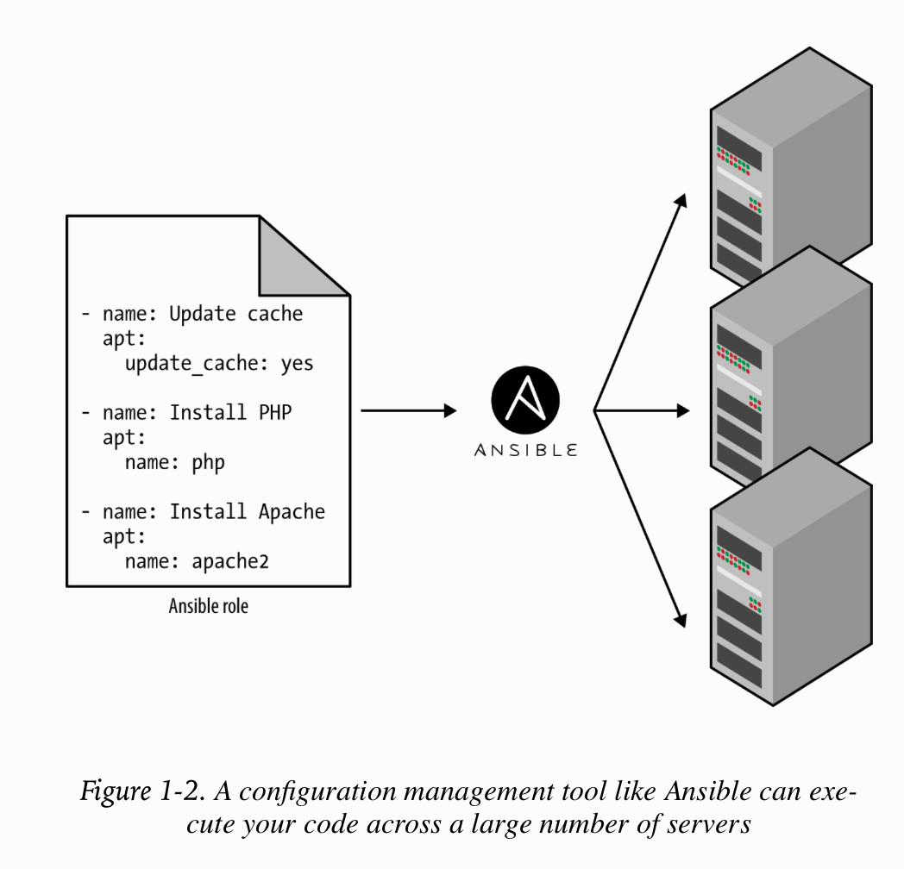

# Infrastructure as Code - Terraform :

### + Preface :

    A long time ago, in a datacenter far, far away, an ancient group of powerful beings known as “sysadmins” used to deploy infrastructure manually.
    Every server, every database, every load balancer, and every bit of network configuration was created and managed by hand.
    It was a dark and fearful age: fear of downtime, fear of accidental misconfiguration, fear of slow and fragile deployments,
    and fear of what would happen if the sysadmins fell to the dark side (i.e., took a vacation). The good news is that thanks to the DevOps movement,
    there is now a better way to do things: Terraform.

    Terraform is an open source tool created by HashiCorp that allows you to define your infrastructure as code using a simple,
    declarative language and to deploy and manage that infrastructure across a variety of public cloud providers
    (e.g., Amazon Web Services, Microsoft Azure, Google Cloud Platform, DigitalOcean) and private cloud and virtualization platforms
    (e.g., OpenStack, VMWare) using a few commands. For example, instead of manually clicking around a web page or running dozens
    of commands, here is all the code it takes to configure a server on AWS:

    provider "aws" {
        region = "us-east-2"
    }

    resource "aws_instance" "example" {
        ami           = "ami-0c55b159cbfafe1f0"
        instance_type = "t2.micro"
    }

    -> name it main.tf

    And to deploy it, you just run the following:

    $ terraform init
    $ terraform apply

    - Why the author wrote that book :

    Terraform is a relatively new technology. As of May 2019, it has not yet hit a 1.0.0 release yet, and despite Terraform’s growing popularity,
    it’s still difficult to find books, blog posts, or experts to help you master the tool. The official Terraform documentation does a good
    job of introducing the basic syntax and features, but it includes little information on idiomatic patterns, best practices, testing,
    reusability, or team workflows. It’s like trying to become fluent in French by studying only the vocabulary but not any of the grammar or idioms.

### + Chapter 1. Why Terraform

    - What Is Infrastructure as Code?

    The idea behind infrastructure as code (IAC) is that you write and execute code to define, deploy, update, and destroy your infrastructure.

    + There are five broad categories of IAC tools:

    1- Ad hoc scripts
    2- Configuration management tools
    3- Server templating tools
    4- Orchestration tools
    5- Provisioning tools

    1- Ad hoc scripts :

    The most straightforward approach to automating anything is to write an ad hoc script. You take whatever task you were doing manually,
    break it down into discrete steps, use your favorite scripting language (e.g., Bash, Ruby, Python) to define each of those steps in code,
    and execute that script on your server.

    -> open a file setup-webserver.sh

    # Update the apt-get cache
    sudo apt-get update

    # Install PHP and Apache
    sudo apt-get install -y php apache2

    # Copy the code from the repository
    sudo git clone https://github.com/brikis98/php-app.git /var/www/html/app

    # Start Apache
    sudo service apache2 start

    - Pros/Cons of using Ad hoc script :

    + If you’ve ever had to maintain a large repository of Bash scripts, you know that it almost always devolves into a mess of unmaintainable spaghetti code.
      Ad hoc scripts are great for small, one-off tasks, but if you’re going to be managing all of your infrastructure as code,
      then you should use an IaC tool that is purpose-built for the job.

    2- Configuration Management Tools :

    Chef, Puppet, Ansible, and SaltStack are all configuration management tools, which means that they are designed to install and manage software on existing servers.
    For example, here is an Ansible Role called web-server.yml that configures the same Apache web server as the setup-webserver.sh script:

    - name: Update the apt-get cache
      apt:
        update_cache: yes

    - name: Install PHP
      apt:
        name: php

    - name: Install Apache
      apt:
        name: apache2

    - name: Copy the code from the repository
      git: repo=https://github.com/brikis98/php-app.git dest=/var/www/html/app

    - name: Start Apache
      service: name=apache2 state=started enabled=yes

    The code looks similar to the Bash script, but using a tool like Ansible offers a number of advantages:

    - Coding conventions :

    Ansible enforces a consistent, predictable structure, including documentation, file layout, clearly named parameters,
    secrets management, and so on. While every developer organizes their ad hoc scripts in a different way,
    most configuration management tools come with a set of conventions that makes it easier to navigate the code.

    - Idempotence :

    Writing an ad hoc script that works once isn’t too difficult; writing an ad hoc script that works correctly even if you run it over and over again is a lot more difficult. Every time you go to create a folder in your script,
    you need to remember to check whether that folder already exists; every time you add a line of configuration to a file, you need to check that line doesn’t already exist; every time you want to run an app, you need to check
    that the app isn’t already running.

    Code that works correctly no matter how many times you run it is called idempotent code. To make the Bash script from the previous section idempotent, you’d need to add many lines of code, including lots of if-statements.
    Most Ansible functions, on the other hand, are idempotent by default. For example, the web-server.yml Ansible role will install Apache only if it isn’t installed already and will try to start the Apache web server only
    if it isn’t running already.

    - Distribution

    Ad hoc scripts are designed to run on a single, local machine. Ansible and other configuration management tools are designed specifically for managing large numbers of remote servers,
    as shown in Figure 1-2.

    For example, to apply the web-server.yml role to five servers, you first create a file called hosts that contains the IP addresses of those servers:

    -> create a file with hosts name.

    [webservers]
    11.11.11.11
    11.11.11.12
    11.11.11.13
    11.11.11.14
    11.11.11.15

    -> next you define the ansible playbook :

    $ create a file playbook.yml

    - hosts: webservers
      roles:
      - webserver

    $ ansible-playbook playbook.yml

    NB: This instructs Ansible to configure all five servers in parallel. Alternatively, by setting a parameter called serial in the playbook,
        you can do a rolling deployment, which updates the servers in batches. For example, setting serial to 2 directs Ansible to update two
        of the servers at a time, until all five are done. Duplicating any of this logic in an ad hoc script would take dozens or even hundreds of lines of code.

