# Infrastructure as Code - Terraform :

### + Preface :

    A long time ago, in a datacenter far, far away, an ancient group of powerful beings known as “sysadmins” used to deploy infrastructure manually.
    Every server, every database, every load balancer, and every bit of network configuration was created and managed by hand.
    It was a dark and fearful age: fear of downtime, fear of accidental misconfiguration, fear of slow and fragile deployments,
    and fear of what would happen if the sysadmins fell to the dark side (i.e., took a vacation). The good news is that thanks to the DevOps movement,
    there is now a better way to do things: Terraform.

    Terraform is an open source tool created by HashiCorp that allows you to define your infrastructure as code using a simple,
    declarative language and to deploy and manage that infrastructure across a variety of public cloud providers
    (e.g., Amazon Web Services, Microsoft Azure, Google Cloud Platform, DigitalOcean) and private cloud and virtualization platforms
    (e.g., OpenStack, VMWare) using a few commands. For example, instead of manually clicking around a web page or running dozens
    of commands, here is all the code it takes to configure a server on AWS:

    provider "aws" {
        region = "us-east-2"
    }

    resource "aws_instance" "example" {
        ami           = "ami-0c55b159cbfafe1f0"
        instance_type = "t2.micro"
    }

    -> name it main.tf

    And to deploy it, you just run the following:

    $ terraform init
    $ terraform apply

    - Why the author wrote that book :

    Terraform is a relatively new technology. As of May 2019, it has not yet hit a 1.0.0 release yet, and despite Terraform’s growing popularity,
    it’s still difficult to find books, blog posts, or experts to help you master the tool. The official Terraform documentation does a good
    job of introducing the basic syntax and features, but it includes little information on idiomatic patterns, best practices, testing,
    reusability, or team workflows. It’s like trying to become fluent in French by studying only the vocabulary but not any of the grammar or idioms.

### + Chapter 1. Why Terraform

    - What Is Infrastructure as Code?

    The idea behind infrastructure as code (IAC) is that you write and execute code to define, deploy, update, and destroy your infrastructure.

    + There are five broad categories of IAC tools:

    1- Ad hoc scripts
    2- Configuration management tools
    3- Server templating tools
    4- Orchestration tools
    5- Provisioning tools

    1- Ad hoc scripts :

    The most straightforward approach to automating anything is to write an ad hoc script. You take whatever task you were doing manually,
    break it down into discrete steps, use your favorite scripting language (e.g., Bash, Ruby, Python) to define each of those steps in code,
    and execute that script on your server.

    -> open a file setup-webserver.sh

    # Update the apt-get cache
    sudo apt-get update

    # Install PHP and Apache
    sudo apt-get install -y php apache2

    # Copy the code from the repository
    sudo git clone https://github.com/brikis98/php-app.git /var/www/html/app

    # Start Apache
    sudo service apache2 start

    - Pros/Cons of using Ad hoc script :

    + If you’ve ever had to maintain a large repository of Bash scripts, you know that it almost always devolves into a mess of unmaintainable spaghetti code.
      Ad hoc scripts are great for small, one-off tasks, but if you’re going to be managing all of your infrastructure as code,
      then you should use an IaC tool that is purpose-built for the job.


    2- Configuration Management Tools :

    Chef, Puppet, Ansible, and SaltStack are all configuration management tools, which means that they are designed to install and manage software on existing servers.
    For example, here is an Ansible Role called web-server.yml that configures the same Apache web server as the setup-webserver.sh script:

    - name: Update the apt-get cache
      apt:
        update_cache: yes

    - name: Install PHP
      apt:
        name: php

    - name: Install Apache
      apt:
        name: apache2

    - name: Copy the code from the repository
      git: repo=https://github.com/brikis98/php-app.git dest=/var/www/html/app

    - name: Start Apache
      service: name=apache2 state=started enabled=yes

    The code looks similar to the Bash script, but using a tool like Ansible offers a number of advantages:

    - Coding conventions :

    Ansible enforces a consistent, predictable structure, including documentation, file layout, clearly named parameters,
    secrets management, and so on. While every developer organizes their ad hoc scripts in a different way,
    most configuration management tools come with a set of conventions that makes it easier to navigate the code.

    - Idempotence :

    Writing an ad hoc script that works once isn’t too difficult; writing an ad hoc script that works correctly even if you run it over and over again is a lot more difficult. Every time you go to create a folder in your script,
    you need to remember to check whether that folder already exists; every time you add a line of configuration to a file, you need to check that line doesn’t already exist; every time you want to run an app, you need to check
    that the app isn’t already running.

    Code that works correctly no matter how many times you run it is called idempotent code. To make the Bash script from the previous section idempotent, you’d need to add many lines of code, including lots of if-statements.
    Most Ansible functions, on the other hand, are idempotent by default. For example, the web-server.yml Ansible role will install Apache only if it isn’t installed already and will try to start the Apache web server only
    if it isn’t running already.

    - Distribution

    Ad hoc scripts are designed to run on a single, local machine. Ansible and other configuration management tools are designed specifically for managing large numbers of remote servers,
    as shown in Figure 1-2.


    For example, to apply the web-server.yml role to five servers, you first create a file called hosts that contains the IP addresses of those servers:

    -> create a file with hosts name.

    [webservers]
    11.11.11.11
    11.11.11.12
    11.11.11.13
    11.11.11.14
    11.11.11.15

    -> next you define the ansible playbook :

    $ create a file playbook.yml

    - hosts: webservers
      roles:
      - webserver

    $ ansible-playbook playbook.yml

    NB: This instructs Ansible to configure all five servers in parallel. Alternatively, by setting a parameter called serial in the playbook,
        you can do a rolling deployment, which updates the servers in batches. For example, setting serial to 2 directs Ansible to update two
        of the servers at a time, until all five are done. Duplicating any of this logic in an ad hoc script would take dozens or even hundreds of lines of code.

    - Server Templating Tools :

    An alternative to configuration management that has been growing in popularity recently are server templating tools such as Docker, Packer, and Vagrant.
    Instead of launching a bunch of servers and configuring them by running the same code on each one, the idea behind server templating tools is to create an
    image of a server that captures a fully self-contained “snapshot” of the operating system (OS), the software, the files, and all other relevant details.
    You can then use some other IaC tool to install that image on all of your servers, as shown in Figure 1-3.


    =+ As shown in Figure 1-4, there are two broad categories of tools for working with images:

    - Virtual Machines
    - Containers


    For example, here is a Packer template called web-server.json that creates an Amazon Machine Image (AMI), which is a VM image that you can run on AWS:

    {
      "builders": [{
        "ami_name": "packer-example",
        "instance_type": "t2.micro",
        "region": "us-east-2",
        "type": "amazon-ebs",
        "source_ami": "ami-0c55b159cbfafe1f0",
        "ssh_username": "ubuntu"
      }],
      "provisioners": [{
        "type": "shell",
        "inline": [
          "sudo apt-get update",
          "sudo apt-get install -y php apache2",
          "sudo git clone https://github.com/brikis98/php-app.git /var/www/html/app"
        ],
        "environment_vars": [
          "DEBIAN_FRONTEND=noninteractive"
        ]
      }]
    }

    + Pre-requisites :

    - You must have Packer installed on your computer.
    - You must have an Amazon Web Services (AWS) account.

    + Configure your AWS access keys as environment variables:

        export AWS_ACCESS_KEY_ID=(your access key id)
        export AWS_SECRET_ACCESS_KEY=(your secret access key)

    To build the AMI:

    $ packer build webserver.json

    This Packer template configures the same Apache web server that you saw in setup-webserver.sh using the same Bash code.4
    The only difference between the preceding code and previous examples is that this Packer template does not start
    the Apache web server (e.g., by calling sudo service apache2 start). That’s because server templates are typically
    used to install software in images, but it’s only when you run the image—for example, by deploying it on a server—that
    you should actually run that software.

    Note that the different server templating tools have slightly different purposes. Packer is typically used to create images that
    you run directly on top of production servers, such as an AMI that you run in your production AWS account.
    Vagrant is typically used to create images that you run on your development computers, such as a VirtualBox image that you
    run on your Mac or Windows laptop. Docker is typically used to create images of individual applications.
    You can run the Docker images on production or development computers, as long as some other tool has configured that computer with the Docker Engine.

    - Docker + Packer -> cluster of servers on aws :

    For example, a common pattern is to use Packer to create an AMI that has the Docker Engine installed, deploy that AMI on a cluster of servers in your AWS account,
    and then deploy individual Docker containers across that cluster to run your applications.

    4- Orchestration Tools :

    + Server templating tools are great for creating VMs and containers, but how do you actually manage them? For most real-world use cases, you’ll need a way to do the following:

    1- Deploy VMs and containers, making efficient use of your hardware.
    2- Roll out updates to an existing fleet of VMs and containers using strategies such as rolling deployment, blue-green deployment, and canary deployment.
    3- Monitor the health of your VMs and containers and automatically replace unhealthy ones (auto healing).
    4- Scale the number of VMs and containers up or down in response to load (auto scaling).
    5- Distribute traffic across your VMs and containers (load balancing).
    6- Allow your VMs and containers to find and talk to one another over the network (service discovery).

    - Tooling :

    Handling these tasks is the realm of orchestration tools such as Kubernetes, Marathon/Mesos, Amazon Elastic Container Service (Amazon ECS), Docker Swarm, and Nomad.
    For example, Kubernetes allows you to define how to manage your Docker containers as code. You first deploy a Kubernetes cluster, which is a group of servers that
    Kubernetes will manage and use to run your Docker containers. Most major cloud providers have native support for deploying managed Kubernetes clusters, such as
    Amazon Elastic Container Service for Kubernetes (Amazon EKS), Google Kubernetes Engine (GKE), and Azure Kubernetes Service (AKS).


    -> create a file and name it deployment.yml :

    apiVersion: apps/v1

    # Use a Deployment to deploy multiple replicas of your Docker
    # container(s) and to declaratively roll out updates to them
    kind: Deployment

    # Metadata about this Deployment, including its name
    metadata:
      name: example-app

    # The specification that configures this Deployment
    spec:
      # This tells the Deployment how to find your container(s)
      selector:
        matchLabels:
          app: example-app

      # This tells the Deployment to run three replicas of your
      # Docker container(s)”
      replicas: 3

      # Specifies how to update the Deployment. Here, we
      # configure a rolling update.
      strategy:
        rollingUpdate:
          maxSurge: 3
          maxUnavailable: 0
        type: RollingUpdate

      # This is the template for what container(s) to deploy
      template:

        # The metadata for these container(s), including labels
        metadata:
          labels:
            app: example-app

        # The specification for your container(s)
        spec:
          containers:

            # Run Apache listening on port 80
            - name: example-app
              image: httpd:2.4.39
              ports:
                 - containerPort: 80


    - This file instructs Kubernetes to create a Deployment, which is a declarative way to define:

    + One or more Docker containers to run together. This group of containers is called a Pod. The Pod defined in the preceding code contains a single Docker container that runs Apache.

    + The settings for each Docker container in the Pod. The Pod in the preceding code configures Apache to listen on port 80.

    + How many copies (aka replicas) of the Pod to run in your cluster. The preceding code configures three replicas. Kubernetes automatically figures out where in your cluster to deploy each Pod,
    using a scheduling algorithm to pick the optimal servers in terms of high availability (e.g., try to run each Pod on a separate server so a single server crash doesn’t take down your app),
    resources (e.g., pick servers that have available the ports, CPU, memory, and other resources required by your containers), performance (e.g., try to pick servers with the least load and fewest containers on them),
    and so on.

    + Kubernetes also constantly monitors the cluster to ensure that there are always three replicas running, automatically replacing any Pods that crash or stop responding.

    + How to deploy updates. When deploying a new version of the Docker container, the preceding code rolls out three new replicas, waits for them to be healthy, and then undeploys the three old replicas.

    ++ That’s a lot of power in just a few lines of YAML! You run kubectl apply -f example-app.yml to instruct Kubernetes to deploy your app. You can then make changes to the YAML file and run kubectl apply again to roll out the updates.

    5- Provisioning Tools :

    Whereas configuration management, server templating, and orchestration tools define the code that runs on each server, provisioning tools such as Terraform, CloudFormation, and OpenStack Heat are responsible for creating the servers themselves.
    In fact, you can use provisioning tools to not only create servers, but also databases, caches, load balancers, queues, monitoring, subnet configurations, firewall settings, routing rules, Secure Sockets Layer (SSL) certificates,
    and almost every other aspect of your infrastructure.

    For example, the following code deploys a web server using Terraform:

    Don’t worry if you’re not yet familiar with some of the syntax. For now, just focus on two parameters:

    ami
    This parameter specifies the ID of an AMI to deploy on the server. You could set this parameter to the ID of an AMI built from the web-server.json Packer template in the previous section, which has PHP, Apache, and the application source code.

    user_data
    This is a Bash script that executes when the web server is booting. The preceding code uses this script to boot up Apache.

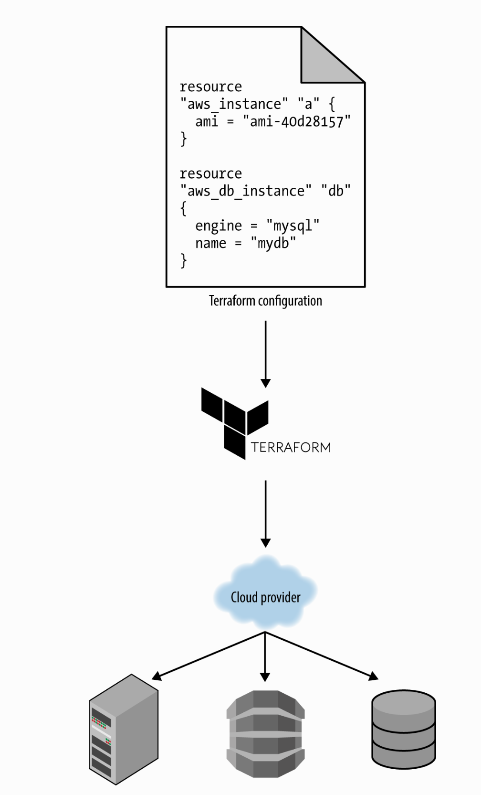

    +++ The Benefits of Infrastructure as Code :

    The answer is that code is powerful. In exchange for the upfront investment of converting your manual practices to code, you get dramatic improvements in your ability to deliver software. According to the 2016 State of DevOps Report,
    organizations that use DevOps practices, such as IaC, deploy 200 times more frequently, recover from failures 24 times faster, and have lead times that are 2,555 times lower.


    +++ How IaC improve software delivery process :

    Self-service
    Most teams that deploy code manually have a small number of sysadmins (often, just one) who are the only ones who know all the magic incantations to make the deployment work and are the only ones with access to production.
    This becomes a major bottleneck as the company grows. If your infrastructure is defined in code, the entire deployment process can be automated, and developers can kick off their own deployments whenever necessary.

    Speed and safety
    If the deployment process is automated, it will be significantly faster, since a computer can carry out the deployment steps far faster than a person; and safer, given that an automated process will be more consistent,
    more repeatable, and not prone to manual error.

    Documentation
    Instead of the state of your infrastructure being locked away in a single sysadmin’s head, you can represent the state of your infrastructure in source files that anyone can read. In other words, IaC acts as documentation,
    allowing everyone in the organization to understand how things work, even if the sysadmin goes on vacation.

    Version control
    You can store your IaC source files in version control,which means that the entire history of your infrastructure is now captured in the commit log. This becomes a powerful tool for debugging issues, because any time a problem pops up,
    your first step will be to check the commit log and find out what changed in your infrastructure, and your second step might be to resolve the problem by simply reverting back to a previous, known-good version of your IaC code.

    Validation
    If the state of your infrastructure is defined in code, for every single change, you can perform a code review, run a suite of automated tests, and pass the code through static analysis tools—all practices
    that are known to significantly reduce the chance of defects.

    Reuse
    You can package your infrastructure into reusable modules, so that instead of doing every deployment for every product in every environment from scratch, you can build on top of known, documented, battle-tested pieces.

    Happiness
    There is one other very important, and often overlooked, reason for why you should use IaC: happiness. Deploying code and managing infrastructure manually is repetitive and tedious. Developers and sysadmins resent this type of work, since it
    involves no creativity, no challenge, and no recognition. You could deploy code perfectly for months, and no one will take notice—until that one day when you mess it up. That creates a stressful and unpleasant environment. IaC offers a
    better alternative that allows computers to do what they do best (automation) and developers to do what they do best (coding).

    ++ Exampe of Terraform code :

    resource "aws_instance" "example" {
      ami           = "ami-0c55b159cbfafe1f0"
      instance_type = "t2.micro"
    }

    resource "google_dns_record_set" "a" {
      name         = "demo.google-example.com"
      managed_zone = "example-zone"
      type         = "A"
      ttl          = 300
      rrdatas      = [aws_instance.example.public_ip]
    }

    Even if you’ve never seen Terraform code before, you shouldn’t have too much trouble reading it. This snippet instructs Terraform to make API calls to AWS to deploy a server and then make API calls to Google Cloud to create a
    DNS entry pointing to the AWS server’s IP address. In just a single, simple syntax,
    Terraform allows you to deploy interconnected resources across multiple cloud providers.

    to deploy :

    $ terraform apply

    -> The terraform binary parses your code, translates it into a series of API calls to the cloud providers specified in the code, and makes those API calls as efficiently as possible.

    - To Update/Change the provisionned servers :

    ++ When someone on your team needs to make changes to the infrastructure, instead of updating the infrastructure manually and directly on the servers, they make their changes in the Terraform configuration files,
    validate those changes through automated tests and code reviews, commit the updated code to version control, and then run the terraform apply command to have Terraform make the necessary API calls to deploy the changes.

    -> TRANSPARENT PORTABILITY BETWEEN CLOUD PROVIDERS :

    ++ could you instruct Terraform to deploy exactly the same infrastructure in another cloud provider, such as Azure or Google Cloud, in just a few clicks?

    Answer: The reality is that you can’t deploy “exactly the same infrastructure” in a different cloud provider because the cloud providers don’t offer the same types of infrastructure! The servers, load balancers, and databases.
    More : Terraform’s approach is to allow you to write code that is specific to each provider, taking advantage of that provider’s unique functionality, but to use the same language, toolset, and IaC practices under the hood for all providers.

    - Templating server (Docker) + Provisionning tools (Terraform) vs Configuration managment (Ansible) :

    1- Mutable Infrastructure Versus Immutable Infrastructure :

    Configuration management tools such as Chef, Puppet, Ansible, and SaltStack typically default to a mutable infrastructure paradigm. For example, if you instruct Chef to install a new version of OpenSSL,
    it will run the software update on your existing servers and the changes will happen in place. Over time, as you apply more and more updates, each server builds up a unique history of changes. As a result,
    each server becomes slightly different than all the others, leading to subtle configuration bugs that are difficult to diagnose and reproduce (this is the same configuration drift problem that happens when
    you manage servers manually, although it’s much less problematic when using a configuration management tool). Even with automated tests these bugs are difficult to catch; a configuration management
    change might work just fine on a test server, but that same change might behave differently on a production server because the production server has accumulated months of changes that aren’t reflected in the test environment.

    If you’re using a provisioning tool such as Terraform to deploy machine images created by Docker or Packer, most “changes” are actually deployments of a completely new server. For example, to deploy a new version of OpenSSL,
    you would use Packer to create a new image with the new version of OpenSSL, deploy that image across a set of new servers, and then terminate the old servers. Because every deployment uses immutable images on fresh servers,
    this approach reduces the likelihood of configuration drift bugs, makes it easier to know exactly what software is running on each server, and allows you to easily deploy any previous version of the software (any previous image) at any time.
    It also makes your automated testing more effective, because an immutable image that passes your tests in the test environment is likely to behave exactly the same way in the production environment.

    - Some downsides of Immutability :

    Of course, it’s possible to force configuration management tools to do immutable deployments, too, but it’s not the idiomatic approach for those tools, whereas it’s a natural way to use provisioning tools. It’s also worth mentioning that
    the immutable approach has downsides of its own. For example, rebuilding an image from a server template and redeploying all your servers for a trivial change can take a long time. Moreover, immutability lasts only until you actually run
    the image. After a server is up and running, it will begin making changes on the hard drive and experiencing some degree of configuration drift (although this is mitigated if you deploy frequently).

    2- Procedural Language Versus Declarative Language :

    Chef and Ansible encourage a procedural style in which you write code that specifies, step by step, how to achieve some desired end state. Terraform, CloudFormation, SaltStack, Puppet, and Open Stack Heat all encourage a more declarative
    style in which you write code that specifies your desired end state, and the IaC tool itself is responsible for figuring out how to achieve that state.

    Examples : (Ansible vs Terraform)

    Ansible :

        - ec2:
            count: 10
            image: ami-0c55b159cbfafe1f0
            instance_type: t2.micro”

    Terraform :

        resource "aws_instance" "example" {
            count         = 15
            ami           = "ami-0c55b159cbfafe1f0"
            instance_type = "t2.micro"
        }

    For example, imagine traffic has gone up and you want to increase the number of servers to 15. With Ansible, the procedural code you wrote earlier is no longer useful; if you just updated the number of servers
    to 15 and reran that code, it would deploy 15 new servers, giving you 25 total! So instead, you need to be aware of what is already deployed and write a totally new procedural script to add the five new servers:

    - ec2:
        count: 5
        image: ami-0c55b159cbfafe1f0
        instance_type: t2.micro

    With declarative code, because all you do is declare the end state that you want, and Terraform figures out how to get to that end state, Terraform will also be aware of any state it created in the past.
    Therefore, to deploy five more servers, all you need to do is go back to the same Terraform configuration and update the count from 10 to 15:

    resource "aws_instance" "example" {
      count         = 15
      ami           = "ami-0c55b159cbfafe1f0"
      instance_type = "t2.micro"
    }

    If you applied this configuration, Terraform would realize it had already created 10 servers and therefore all it needs to do is create five new servers.
    In fact, before applying this configuration, you can use Terraform’s plan command to preview what changes it would make:

    $ terraform plan

    - Making changes between (Ansible vs Terraform) :

    Now what happens when you want to deploy a different version of the app, such as AMI ID ami-02bcbb802e03574ba? With the procedural approach, both of your previous Ansible templates are again not useful,
    so you need to write yet another template to track down the 10 servers you deployed previously (or was it 15 now?) and carefully update each one to the new version. With the declarative approach of Terraform,
    you go back to the exact same configuration file again and simply change the ami parameter to ami-02bcbb802e03574ba:

    resource "aws_instance" "example" {
      count         = 15
      ami           = "ami-02bcbb802e03574ba"
      instance_type = "t2.micro”
    }

### + Best Combination Provisionning + Server templating :

- PROVISIONING PLUS SERVER TEMPLATING PLUS ORCHESTRATION :


    Example: Terraform, Packer, Docker, and Kubernetes. You use Packer to create a VM image that has Docker and Kubernetes installed. You then use Terraform to deploy (a) a cluster of servers, each of which runs this VM image,
    and (b) the rest of your infrastructure, including the network topology (i.e., VPCs, subnets, route tables), data stores (e.g., MySQL, Redis), and load balancers. Finally, when the cluster of servers boots up, it forms a
    Kubernetes cluster that you use to run and manage your Dockerized applications, as shown in Figure 1-11.

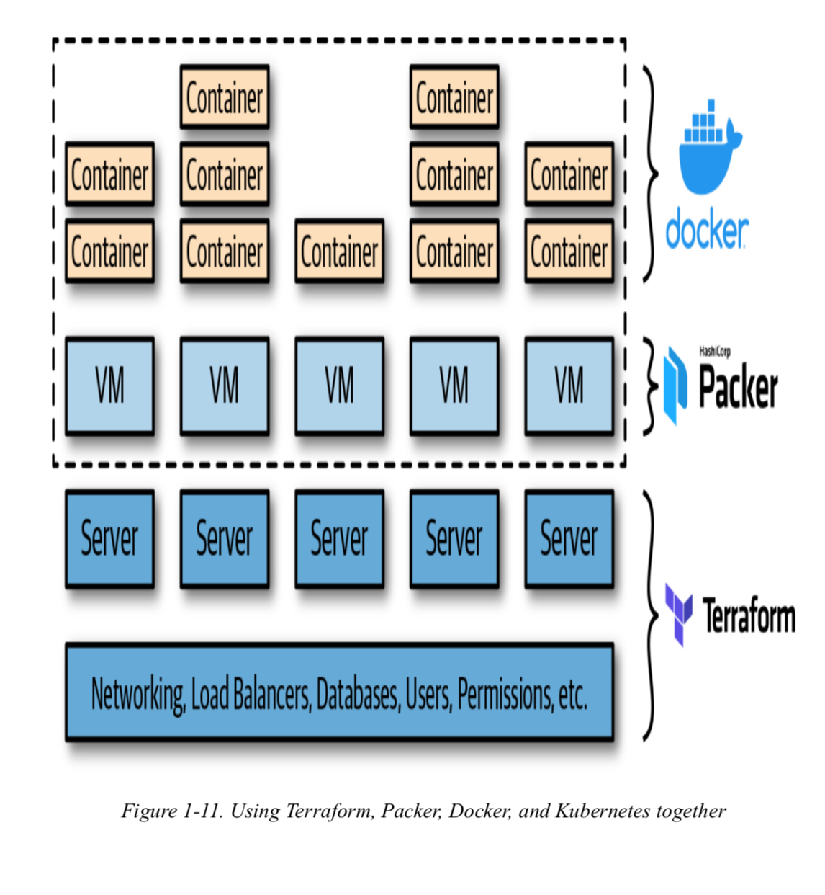

### + Getting Started with Terraform :

    + First Tutorial that combine Terraform and AWS :

        - Setting up your AWS account Installing Terraform
        - Deploying a single server
        - Deploying a single web server
        - Deploying a configurable web server
        - Deploying a cluster of web servers
        - Deploying a load balancer
        - Cleaning up


    - Advice about AWS Root account :
    -> it’s not a good idea to use the root user on a day-to-day basis. In fact, the only thing you should use the root user for is to create other user accounts with more-limited permissions, and then switch to one of those accounts immediately.

    ++ after creating the IAM account AWS will show you the security credentials for that user, which consist of an Access Key ID and a Secret Access Key, You must save these immediately because they will never be shown again, and you’ll need them later on in this tutorial.
    Remember that these credentials give access to your AWS account, so store them somewhere secure.

    + Add account permissions :

        AmazonEC2FullAccess
        AmazonS3FullAccess
        AmazonDynamoDBFullAccess
        AmazonRDSFullAccess
        CloudWatchFullAccess
        IAMFullAccess

    + About Virtual Private Cloud :

    A NOTE ON DEFAULT VIRTUAL PRIVATE CLOUDS

    If you are using an existing AWS account, it must have a Default VPC in it. A VPC, or Virtual Private Cloud, is an isolated area of your AWS account that has its own virtual network and IP address space. Just about every AWS resource deploys into a VPC.
    If you don’t explicitly specify a VPC, the resource will be deployed into the Default VPC, which is part of every new AWS account. All of the examples in this book rely on this Default VPC, so if for some reason you deleted the one in your account,
    either use a different region (each region has its own Default VPC) or create a new Default VPC using the AWS Web Console. Otherwise, you’ll need to update almost every example to include a vpc_id or subnet_id parameter pointing to a custom VPC.


    + Install Terraform on OSX :

    $ brew install terraform

    run :
    $ terraform

    2- For Terraform to be able to make changes in your AWS account, you will need to set the AWS credentials for the IAM user you created earlier as the environment variables AWS_ACCESS_KEY_ID and AWS_SECRET_ACCESS_KEY.

         $ export AWS_ACCESS_KEY_ID=(your access key id)
         $ export AWS_SECRET_ACCESS_KEY=(your secret access key)

    NB: Note that these environment variables apply only to the current shell, so if you reboot your computer or open a new terminal window, you’ll need to export these variables again.

    - First Of All we should authenticate to aws cli/sdk :

    1- we should install `aws cli` on our machine.
    -> https://docs.aws.amazon.com/cli/latest/userguide/install-cliv2-mac.html

    2- run : `aws configure` and enter your credentials (keys, region etc)

    - AUTHENTICATION OPTIONS :
    In addition to environment variables, Terraform supports the same authentication mechanisms as all AWS CLI and SDK tools. Therefore, it’ll also be able to use credentials in $HOME/.aws/credentials, which are automatically 
    generated if you run the configure command on the AWS CLI, or IAM Roles, which you can add to almost any resource in AWS.

    1- Deploy a single Server :

    1-1 The first step to using Terraform is typically to configure the provider(s) you want to use. Create an empty folder and put a file in it called main.tf that contains the following contents:
    
    ```
        provider "aws" {
            region = "us-east-2"
        }
    ```
    
    - For each type of provider, there are many different kinds of resources that you can create, such as servers, databases, and load balancers. The general syntax for creating a resource in Terraform is:
    
    ```
        resource "<PROVIDER>_<TYPE>" "<NAME>" {
            [CONFIG ...]
        }
    ```

    -- where PROVIDER is the name of a provider (e.g., aws), TYPE is the type of resource to create in that provider (e.g., instance), NAME is
       an identifier you can use throughout the Terraform code to refer to this resource (e.g., my_instance), and CONFIG consists of one or more arguments that are specific to that resource.

    # For example, to deploy a single (virtual) server in AWS, known as an EC2 Instance, use the aws_instance resource in main.tf as follows:
    
    ```
        resource "aws_instance" "web_server_instance" {
            ami = "ami-0c55b159cbfafe1f0"
            instance_type = "t2.micro"
        }
    ```

    The aws_instance resource supports many different arguments, but for now, you only need to set the two required ones:
    
    - ami
    The Amazon Machine Image (AMI) to run on the EC2 Instance. You can find free and paid AMIs in the AWS Marketplace or create your own using tools such as Packer 
    (see “Server Templating Tools” for a discussion of machine images and server templating). The preceding code example sets the ami parameter to the ID of an 
    Ubuntu 18.04 AMI in us-east-2. This AMI is free to use.
    
    - instance_type
    The type of EC2 Instance to run. Each type of EC2 Instance provides a different amount of CPU, memory, disk space, and networking capacity. 
    The EC2 Instance Types page lists all the available options. The preceding example uses t2.micro, which has one virtual CPU, 1 GB of memory, 
    and is part of the AWS free tier.
    
    - link to terraform documentation :
    https://registry.terraform.io/providers/hashicorp/aws/latest/docs/resources/instance
    
    - Finally :
    ++ In a terminal, go into the folder where you created main.tf and run the `terraform init` command.
    
    NB: just be aware that you need to run init any time you start with new Terraform code, and that it’s safe to run init multiple times
    
    - Now that you have the provider code downloaded, run the `terraform plan` command.
    
    -> about `terraform plan` command :

    The plan command lets you see what Terraform will do before actually making any changes. This is a great way to sanity check your code before 
    unleashing it onto the world. The output of the plan command is similar to the output of the diff command that is part of Unix, Linux, 
    and git: anything with a plus sign (+) will be created, anything with a minus sign (–) will be deleted, and anything with a tilde sign (~) 
    will be modified in place. In the preceding output, you can see that Terraform is planning on creating a single EC2 Instance and nothing else, which is exactly what you want.
    
    - then run `terraform apply` command.

    Congrats, you’ve just deployed an EC2 Instance in your AWS account using Terraform! To verify this, head over to the EC2 console; 
    
    - Update EC2 Instance :

    Sure enough, the Instance is there, though admittedly, this isn’t the most exciting example. Let’s make it a bit more interesting. First, notice that the EC2 Instance doesn’t have a name. 
    To add one, you can add tags to the aws_instance resource:

    ```
        resource "aws_instance" "web_server_instance" {
            ami = "ami-0c55b159cbfafe1f0"
            instance_type = "t2.micro"
    
            tags = {
                Name = "terraform-instance"
            }
        }
    ```
    
    2- Deploy a Single web-srver :

    The next step is to run a web server on this Instance. The goal is to deploy the simplest web architecture possible: 
    a single web server that can respond to HTTP requests

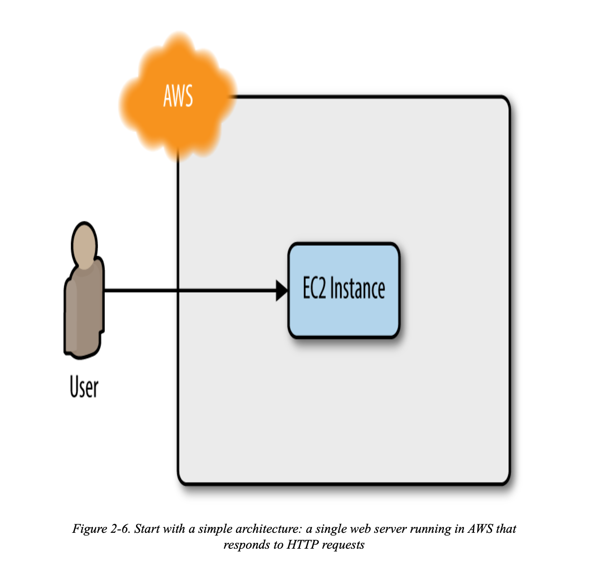

    In a real-world use case, you’d probably build the web server using a web framework like Ruby on Rails or Django, 
    but to keep this example simple, let’s run a `dirt-simple web server` that always returns the text “Hello, World”:

    This is a Bash script that writes the text “Hello, World” into index.html and runs a tool called busybox 
    (which is installed by default on Ubuntu) to fire up a web server on port 8080 to serve that file. 

    -> file `server.sh` :
    ```
    echo "Hello, world" > index.html
    nohup busybox httpd -f -p 8080 &
    ```
    
    -- I wrapped the busybox command with nohup and & so that the web server runs permanently in the background, 
       whereas the Bash script itself can exit.

    ++ PORT NUMBERS :
    The reason this example uses port 8080, rather than the default HTTP port 80, is that listening on any port less than 1024 
    requires root user privileges. This is a security risk, because any attacker who manages to compromise your server would 
    get root privileges, too.
    Therefore, it’s a best practice to run your web server with a non-root user that has limited permissions. 
    That means you have to listen on higher-numbered ports, but as you’ll see later in this chapter, 
    you can configure a load balancer to listen on port 80 and route traffic to the high-numbered ports on your server(s).

    -- How do you get the EC2 Instance to run this script? 

    Normally, as discussed in “Server Templating Tools”, you would use a tool like Packer to create a custom AMI that has 
    the web server installed on it. Since the dummy web server in this example is just a one-liner that uses busybox, 
    you can use a plain Ubuntu 18.04 AMI, and run the “Hello, World” script as part of the EC2 Instance’s User Data configuration. 
    When you launch an EC2 Instance, you have the option of passing either a shell script or cloud-init directive to User Data, 
    and the EC2 Instance will execute it during boot. You pass a shell script to User Data by setting the user_data argument 
    in your Terraform code as follows:
    
    ```
        resource "aws_instance" "web_server_instance" {
          ami = "ami-0c55b159cbfafe1f0"
          instance_type = "t2.micro"
          user_data = <<-EOF
                      #!/bin/bash
                      echo "Hello, world" > index.html
                      nohup busybox httpd -f -p 8080 &
                      EOF
          tags = {
            Name = "terraform-instance"
          }
        }
    ```
    
    -- The <<-EOF and EOF are Terraform’s heredoc syntax, which allows you to create multiline strings without having to insert newline 
       characters all over the place.
    
    - Allow EC2 Instance to receive Traffic :

    You need to do one more thing before this web server works. By default, AWS does not allow any incoming or outgoing traffic from an EC2 Instance. 
    To allow the EC2 Instance to receive traffic on port 8080, you need to create a security group:
    
    ```
        resource "aws_security_group" "instance" {
          name = "terraform-example-instance"
        
          ingress {
            from_port = 8080
            to_port = 8080
            protocol = "tcp"
            cidr_blocks = ["0", "0", "0", "0"]
          }
        
        }
    ```
    
    This code creates a new resource called aws_security_group (notice how all resources for the AWS provider begin with aws_) and specifies that this group allows incoming TCP requests on port
    8080 from the CIDR block 0.0.0.0/0. CIDR blocks are a concise way to specify IP address ranges. For example, a CIDR block of 10.0.0.0/24 represents all IP addresses between 10.0.0.0 and 10.0.0.255. 
    The CIDR block 0.0.0.0/0 is an IP address range that includes all possible IP addresses, so this security group allows incoming requests on port 8080 from any IP.
    
    - Connect EC2 with security group to allow Traffic :
    ++ Simply creating a security group isn’t enough; you also need to tell the EC2 Instance to actually use it by passing the ID of the security group into the vpc_security_group_ids argument of the aws_instance resource. 
       To do that, you first need to learn about Terraform expressions.

    One particularly useful type of expression is a reference, which allows you to access values from other parts of your code. To access the ID of the security group resource, you are going to need to use a resource attribute reference, which uses the following syntax:
    --  `<PROVIDER>_<TYPE>.<NAME>.<ATTRIBUTE>`
    
    ++ Complete the expression :
    - where PROVIDER is the name of the provider (e.g., aws), TYPE is the type of resource (e.g., security_group), NAME is the name of that resource (e.g., the security group is named "instance"), 
      and ATTRIBUTE is either one of the arguments of that resource (e.g., name) or one of the attributes exported by the resource (you can find
      the list of available attributes in the documentation for each resource).
    
    add this expression to ec2 resource : `vpc_security_group_ids = [aws_security_group.instance.id]`
    
    +++ When you add a reference from one resource to another, you create an implicit dependency. Terraform parses these dependencies, builds a dependency graph from them, and uses that to automatically determine 
        in which order it should create resources.

    -- You can even get Terraform to show you the dependency graph by running the graph command :
    -> run `terraform graph`

-> you can turn this description language into a visual graph using this tool :
[here](http://dreampuf.github.io/GraphvizOnline/)

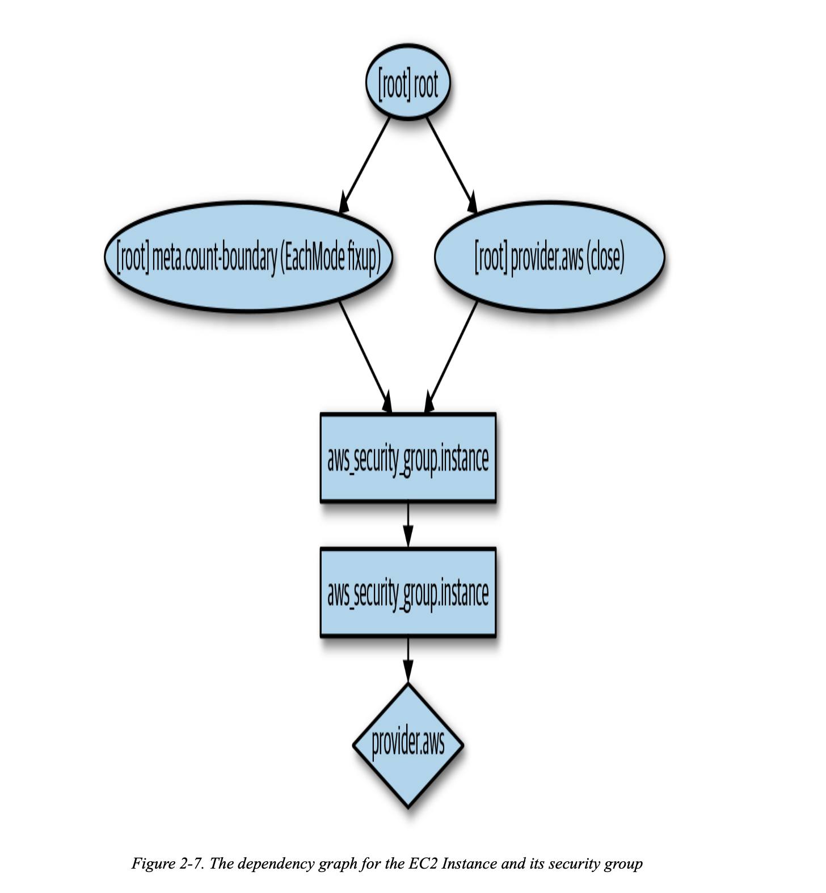
    
    
    NB: It’s worth mentioning that although the web server is being replaced, any users of that web server would experience downtime; 
        you’ll see how to do a zero-downtime deployment with Terraform.

    - Finally, we should ping public ip address that we could find when we click on the instance in aws console.
    
    ```
        $ curl http://<EC2_INSTANCE_PUBLIC_IP>:8080
        Hello, World
    ```

    Yay! You now have a working web server running in AWS!
    
    - Network Security :

    Therefore, for production systems, you should deploy all of your servers, and certainly all of your data stores, in private subnets, 
    which have IP addresses that can be accessed only from within the VPC and not from the public internet. 
    The only servers you should run in public subnets are a small number of reverse proxies and load balancers that you lock down as much as possible
    
    2- Deploy a Configurable Web Server :

    You might have noticed that the web server code has the port 8080 duplicated in both the security group and the User Data configuration. This violates the Don’t Repeat Yourself (DRY) principle: 
    every piece of knowledge must have a single, unambiguous, authoritative representation within a system.8 If you have the port number in two places, it’s easy to update it in one place but forget 
    to make the same change in the other place.
    To allow you to make your code more DRY and more configurable, Terraform allows you to define input variables. Here’s the syntax for declaring a variable:

    ```
    variable "NAME" {
        [CONFIG ...]
    }
    ```
    
    The body of the variable declaration can contain three parameters, all of them optional:
    
    - description :
    It’s always a good idea to use this parameter to document how a variable is used. Your teammates will not only be able to see this description
    while reading the code, but also when running the plan or apply commands
    
    - default
    There are a number of ways to provide a value for the variable, including passing it in at the command line (using the -var option), via a file (using the -var-file option), or via an environment variable (Terraform looks for environment variables
    of the name TF_VAR_<variable_name>). If no value is passed in, the variable will fall back to this default value. If there is no default value, Terraform will interactively prompt the user for one.
    
    - type
    This allows you enforce type constraints on the variables a user passes in. Terraform supports a number of type constraints, including string, number, bool, list, map, set, object, tuple, and any. If you don’t specify a type, Terraform assumes the type is any.
    
    Here is an example of an input variable that checks to verify that the value you pass in is a number:
    
    ```
    variable "number_example" {
        description = "An example of a number variable in
                        Terraform"
        type = number
        default = 42 
        }
    ```
    
    And here’s an example of a variable that checks whether the value is a list:
    
    ```
    variable "list_example" {
        description = "An example of a list in Terraform" type = list
        default = ["a", "b", "c"]
    }
    ```

    You can combine type constraints, too. For example, here’s a list input variable that requires all of the items in the list to be numbers:
    
    ```
    variable "list_numeric_example" {
        description = "An example of a numeric list in Terraform" 
        type = list(number)
        default = [1,2,3,4]
    ```
    
    And here’s a map that requires all of the values to be strings:

    ```
    variable "map_example" {
        description = "An example of a map in Terraform" type = map(string)
          default = {
            key1 = "value1"
            key2 = "value2"
            key3 = "value3"
        } 
    }
    ```

    ```
    variable "object_example" {
    
    description = "An example of a structural type in Terraform"    
    
    type = object({
        age = number
        name = string
        tags = list(string)
        enabled = bool
    })

    default = {
            age = 25
            name = "Mohamed El Rahali"
            tags = ["work", "hobbies"]
            enabled = true
        }
    }
    ```

    - Refactor terraform code to use server_port as a variable :
    ```
    variable "server_port" {
      description = "The port the server will use for HTTP requests"
      type = number
      default = 8080
    }
    ```

    you can also let `default` param empty and use terminal arg `-var` :
    
    - terraform plan -var "server_port"=8080 
    
    You could also set the variable via an environment variable named TF_VAR_<name>, where <name> is the name of the variable you’re trying to set:
    
    $ export TF_VAR_server_port=8080
    $ terraform plan
    
    - To use the value from an input variable in your Terraform code :

    + var.<VARIABLE_NAME>
    
    ALSO TO USE THE VARIABLE INSIDE `user_data` (string literal):

    user_data = <<-EOF #!/bin/bash
            echo "Hello, World" > index.html
            nohup busybox httpd -f -p ${var.server_port} &
            EOF

    2- to define output variable that you could request to check validity of a variable :
    
    ```
    output "<NAME>" {
        value = <VALUE>
        [CONFIG ...]
    }
    ```
    
    The NAME is the name of the output variable, and VALUE can be any Terraform expression that you would like to output. The CONFIG can contain two additional parameters, both optional:
    
    + description :
    It’s always a good idea to use this parameter to document what type of data is contained in the output variable.
    
    + sensitive :
    Set this parameter to true to instruct Terraform not to log this output at the end of terraform apply. This is useful if the output variable contains sensitive material or secrets such as passwords or private keys.
      
    For example, instead of having to manually poke around the EC2 console to find the IP address of your server, you can provide the IP address as an output variable:

    ```
    output "public_ip" {
        value       = aws_instance.example.public_ip
        description = "The public IP address of the web server"
    }
    ```

    - terraform apply

    NB: You can also use the terraform output command to list all outputs without applying any changes.
    
    -> terraform output
    or terraform output public_ip
    
    - Conclusion :

    This is particularly handy for scripting. For example, you could create a deployment script that runs terraform apply to deploy the web server, uses terraform output public_ip to grab its public IP, 
    and runs curl on the IP as a quick smoke test to validate that the deployment worked.
    
    3- Deploying a Cluster of Web Servers :

    Managing such a cluster manually is a lot of work. Fortunately, you can let AWS take care of it for by you using an Auto Scaling Group
    An ASG takes care of a lot of tasks for you completely automatically, including launching a cluster of EC2 Instances, monitoring 
    the health of each Instance, replacing failed Instances, and adjusting the size of the cluster in response to load.
    
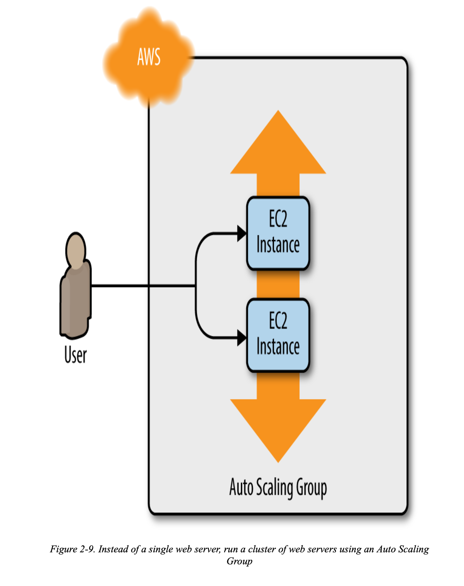
    
    The first step in creating an ASG is to create a launch configuration, which specifies how to configure each EC2 Instance in the ASG. The aws_launch_configuration resource uses 
    almost exactly the same parameters as the aws_instance resource (two of the parameters have different names: ami is now image_id and vpc_security_group_ids is now security_groups),    

    ```
        resource "aws_launch_configuration" "web_server_instance" {
          image_id = "ami-0c55b159cbfafe1f0"
          instance_type = "t2.micro"
          vpc_security_group = [aws_security_group.instance.id]
          user_data = <<-EOF
                      #!/bin/bash
                      echo "Hello, world" > index.html
                      nohup busybox httpd -f -p ${var.server_port} &
                      EOF
        
        }
    ```
    
    Now you can create the ASG itself using the aws_autoscaling_group resource:

    ```
        
        resource "aws_autoscaling_group" "example" {
        launch_configuration = aws_launch_configuration.example.name

        min_size = 2
        max_size = 10

          tag {
            key     = "Name"
            value   = "terraform-asg-example"
            propagate_at_launch = true
          }
    }
    ```

    PAY ATTENTION :

    This ASG will run between 2 and 10 EC2 Instances (defaulting to 2 for the initial launch), each tagged with the name terraform- asg-example. Note that the ASG uses a reference to fill in the launch configuration name. (THE VARIABLE `launch_configuration = aws_launch_configuration.example.name`) This leads to a problem: 
    launch configurations are immutable, so if you change any parameter of your launch configuration, Terraform will try to replace it. Normally, when replacing a resource, Terraform `deletes the old resource first` and `then creates its replacement`, but because your ASG now has a reference to the old resource, Terraform won’t be able to delete it.

    - That we should create the new launch configuration before destroying the old one like that we won't get this problem.
    
    ++ Lifecycles :

    To solve this problem, you can use a lifecycle setting. Every Terraform resource supports several lifecycle settings that configure how that resource is created, updated, and/or deleted. A particularly useful lifecycle setting is create_before_destroy. If you set create_before_destroy to true, Terraform will invert the order in which it replaces resources, 
    creating the replacement resource first (including updating any references that were pointing at the old resource to point to the replacement) and then deleting the old resource. Add the lifecycle block to your
    
    ```
        resource "aws_launch_configuration" "example" {
              image_id = "ami-0c55b159cbfafe1f0"
              instance_type = "t2.micro"
              security_groups = [aws_security_group.instance.id]
              user_data = <<-EOF
                          #!/bin/bash
                          echo "Hello, world" > index.html
                          nohup busybox httpd -f -p ${var.server_port} &
                          EOF
            -----------------------------------
              lifecycle {
                create_before_destroy = true
              }
            ------------------------------------
        }
    ```

    - Subnets :

    There’s also one other parameter that you need to add to your ASG to make it work: subnet_ids. This parameter specifies to the ASG into which VPC subnets the EC2 Instances should be deployed (see Network Security for background info on subnets). Each subnet lives in an isolated AWS AZ (that is, isolated datacenter), so by deploying your Instances across multiple subnets,
    you ensure that your service can keep running even if some of the datacenters have an outage. You could hardcode the list of subnets, but that won’t be maintainable or portable, so a better option is to use data sources to get the list of subnets in your AWS account.

    - Data sources :
    
    A data source represents a piece of read-only information that is fetched from the provider (in this case, AWS) every time you run Terraform. Adding a data source to your Terraform configurations does not create anything new; it’s just a way to query the provider’s APIs for data and to make that data available to the rest of your Terraform code. 
    Each Terraform provider exposes a variety of data sources. For example, the AWS provider includes data sources to look up VPC data, subnet data, AMI IDs, IP address ranges, the current user’s identity, and much more.
    
    ```
        data "<PROVIDER>_<TYPE>" "<NAME>" {
            [CONFIG ...]
        }
    ``` 

    Here, PROVIDER is the name of a provider (e.g., aws), TYPE is the type of data source you want to use (e.g., vpc), NAME is an identifier
    you can use throughout the Terraform code to refer to this data source, and CONFIG consists of one or more arguments that are specific to that data source. For example, here is how you can use the aws_vpc data source to look up the data for your Default VPC
    
    ```
        data "aws_vpc" "default" {
            default = true
        }
    ```

    Note that with data sources, the arguments you pass in are typically search filters that indicate to the data source what information you’re looking for. With the aws_vpc data source, the only filter you need is default = true, which directs Terraform to look up the Default VPC in your AWS account.

    To get the data out of a data source, you use the following attribute reference syntax:
    
    -> `data.<PROVIDER>_<TYPE>.<NAME>.<ATTRIBUTE>`

    For example, to get the ID of the VPC from the aws_vpc data
    source, you would use the following:

    -> `data.aws_vpc.default.id`

    You can combine this with another data source, aws_subnet_ids, to look up the subnets within that VPC:
    Finally, you can pull the subnet IDs out of the aws_subnet_ids data source and tell your ASG to use those subnets via the (somewhat oddly named) vpc_zone_identifier argument:
    
    ```
        data "aws_subnet_ids" "default" { 
            vpc_id = data.aws_vpc.default.id
        }
    ```

    3-2 Deploying a Load Balancer :
    
    At this point, you can deploy your ASG, but you’ll have a small problem: you now have multiple servers, each with its own IP address, but you typically want to give of your end users only a single IP to use. One way to solve this problem is to deploy a load balancer to distribute traffic across your servers and to give all your users the IP (actually, the DNS name) of the load balancer. 
    Creating a load balancer that is highly available and scalable is a lot of work. Once again, you can let AWS take care of it for you, this time by using Amazon’s Elastic Load Balancer (ELB) service, as shown in Figure 2-10.

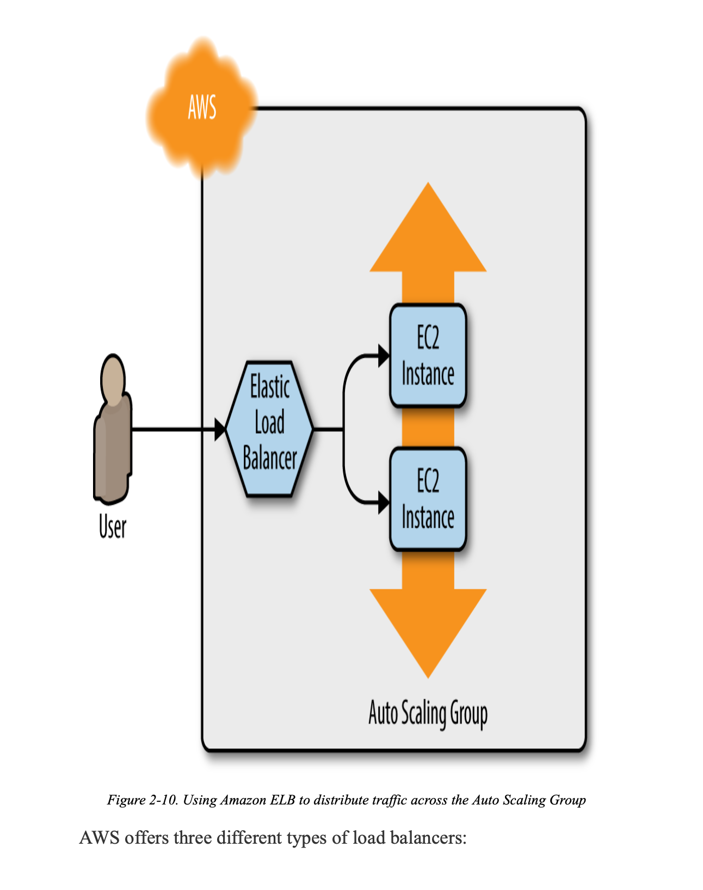    
    
    - AWS offers three different types of load balancers:    

    1- Application Load Balancer (ALB)
    Best suited for load balancing of HTTP and HTTPS traffic. Operates at the application layer (Layer 7) of the OSI model.
    
    2- Network Load Balancer (NLB)
    Best suited for load balancing of TCP, UDP, and TLS traffic. Can scale up and down in response to load faster than the ALB (the NLB is designed to scale to tens of millions of requests per second). Operates at the transport layer (Layer 4) of the OSI model.
    
    3- Classic Load Balancer (CLB)
    This is the “legacy” load balancer that predates both the ALB and NLB. It can handle HTTP, HTTPS, TCP, and TLS traffic, but with far fewer features than either the ALB or NLB. Operates at both the application layer (L7) and transport layer (L4) of the OSI model.
        
    --> Most applications these days should use either the ALB or the NLB. Because the simple web server example you’re working on is an HTTP app without any extreme performance requirements, the ALB is going to be the best fit.

    As shown in Figure 2-11, the ALB consists of several parts: 
    
    1- Listener
    Listens on a specific port (e.g., 80) and protocol (e.g., HTTP).
    
    2- Listener rule
    Takes requests that come into a listener and sends those that match specific paths 
    (e.g., /foo and /bar) or hostnames (e.g., foo.example.com and bar.example.com) to specific target groups.
    
    3- Target groups
    One or more servers that receive requests from the load balancer. The target group also performs health checks on these servers and only sends requests to healthy nodes.
    
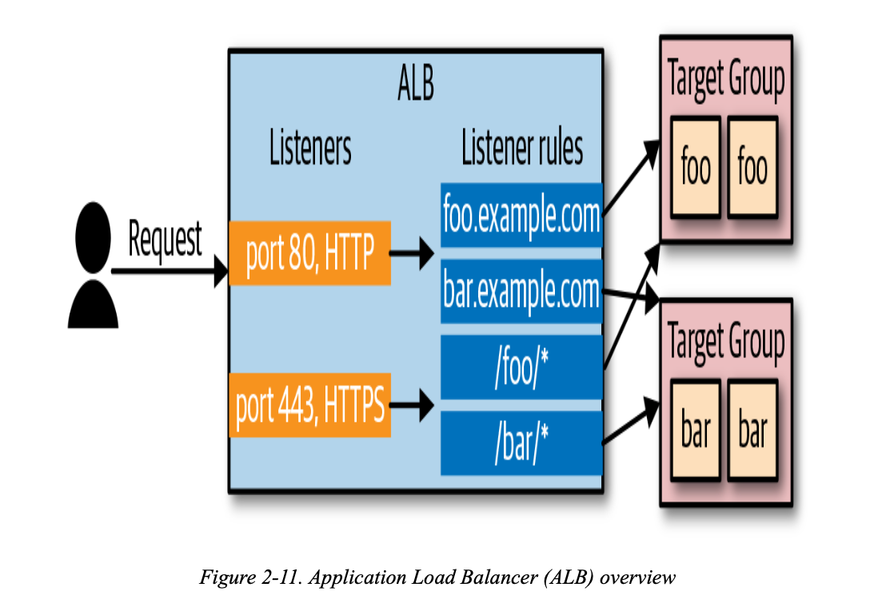
    
    The first step is to create the ALB itself using the aws_lb resource:
    
    resource "aws_lb" "example" {
    name = "terraform-asg-example" load_balancer_type = "application"
    subnets = data.aws_subnet_ids.default.ids
    }
    
    Note that the subnets parameter configures the load balancer to use all the subnets in your Default VPC by using the aws_subnet_ids data source.
    NB:  AWS automatically scales the number of load balancer servers up and down based on traffic and handles failover if one of those servers goes down, so you get scalability and high availability out of the box.

    - Define a listener :

        resource "aws_lb_listener" "http" {
          load_balancer_arn = aws_lb.example.arn
          port = 80
          protocol = "HTTP"
        
          # By default, return a simple 404 page
          # Listener Rules
          default_action {
            type = "fixed-response"
        
            fixed_response {
              content_type = "text/plain"
              message_body = "404: page not found"
              status_code = 404
            }
          }
        }

    --> This listener configures the ALB to listen on the default HTTP port, port 80, use HTTP as the protocol, and send a simple 404 page as the default response for requests that don’t match any listener rules.
    
    Note that, by default, all AWS resources, including ALBs, don’t allow any incoming or outgoing traffic, so you need to create a new security group specifically for the ALB. This security group should 
    allow incoming requests on port 80 so that you can access the load
    balancer over HTTP, and outgoing requests on all ports so that the load balancer can perform health checks:

    NB: there is no problem using port 80 (under 1024) for the loadbalancer but it could be a threat using this port in the server this why we used 8080 in ec2 instances.
    
    ```
        resource "aws_security_group" "alb" {
          name = "terraform-example-alb"
        
          # Allow inbound HTTP requests
          ingress {
            from_port = 80
            protocol  = "tcp"
            to_port   = 80
            cidr_blocks = ["0.0.0.0/0"] # you can use any IP address
          }
        
          # Allow all outbound requests
        
          egress {
            from_port = 0
            protocol  = "-1"
            to_port   = 0
            cidr_blocks = ["0.0.0.0/0"]
          }
        
        }

    ```

    You’ll need to tell the aws_lb resource to use this security group via the security_groups argument:
    
    ````
    resource "aws_lb" "example" {
        name = "terraform-asg-example" 
        load_balancer_type = "application"
        subnets = data.aws_subnet_ids.default.ids
        security_groups    = [aws_security_group.alb.id]
    }
    ```

    Next, you need to create a target group for your ASG using the aws_lb_target_group resource:
    
    ```

    resource "aws_alb_target_group" "asg" {
      name = "terraform-asg-example"
      port = var.server_port
      protocol = "HTTP"
      vpc_id = data.aws_vpc.default.id
    
      health_check {
        path = "/"
        protocol = "HTTP"
        matcher = "200"
        interval = 15
        timeout = 3
        healthy_threshold = 2
        unhealthy_threshold = 2
      }
    }
    
    ```

    +++ Note that this target group will health check your Instances by periodically 
        sending an HTTP request to each Instance and will consider the Instance “healthy” 
        only if the Instance returns a response that matches the configured matcher 
        (e.g., you can configure a matcher to look for a 200 OK response). If an Instance fails to respond, 
        perhaps because that Instance has gone down or is overloaded, it will be marked as “unhealthy,” and 
        the target group will automatically stop sending traffic to it to minimize disruption for your users.

    How does the target group know which EC2 Instances to send requests to? You could attach a static list of EC2 Instances 
    to the target group using the aws_lb_target_group_attachment resource, but with an ASG, Instances can launch or terminate at any time, 
    so a static list won’t work. Instead, you can take advantage of the first-class integration between the ASG and the ALB. 
    Go back to the aws_autoscaling_group resource and set its target_group_arns argument to point at your new target group:

    ``
    resource "aws_autoscaling_group" "example" {
      launch_configuration = aws_launch_configuration.example.name
      vpc_zone_identifier = data.aws_subnet_ids.default.ids
        ----------------------------------------
      target_group_arns = [aws_alb_target_group.asg.arn]
      health_check_type = "ELB"
        ----------------------------------------
      min_size = 2
      max_size = 10
    
      tag {
        key     = "Name"
        value   = "terraform-asg-example"
        propagate_at_launch = true
      }
    }
    ```

    - Health check type :

    You should also update the health_check_type to "ELB". The default health_check_type is "EC2", which is a minimal
    health check that considers an Instance unhealthy only if the AWS hypervisor says the VM is completely down or unreachable. 
    The "ELB" health check is more robust, because it instructs the ASG to use the target group’s health check to determine whether 
    an Instance is healthy and to automatically replace Instances if the target group reports them as unhealthy. That way, 
    Instances will be replaced not only if they are completely down, but also if, for example, they’ve stopped serving 
    requests because they ran out of memory or a critical process crashed.

    Finally, it’s time to tie all these pieces together by creating listener rules using the aws_lb_listener_rule resource:
    
    ```
        resource "aws_alb_listener_rule" "asg" {
          listener_arn = aws_lb_listener.http.arn
          priority = 100
        
          action {
            type = "forward"
            target_group_arn = aws_alb_target_group.asg.arn
          }
        
          condition {
            path_pattern {
                values = ["*"]
            }
          }
        }
    ```
    
    There’s one last thing to do before you deploy the load balancer— replace the old public_ip output of the single EC2 Instance you had before with an output that shows the DNS name of the ALB:
    
    ```
        output "alb_dns_name" {
          value = aws_alb.example.dns_name
          description = "The domain name of the load balancer"
        
        }
    ```

    Run terraform apply and read through the plan output. You should see that your original single EC2 Instance is being removed, and in its place, Terraform will create a launch configuration, 
    ASG, ALB, and a security group. If the plan looks good, type yes and hit Enter. 
    When apply completes, you should see the alb_dns_name output:

    Outputs:
    alb_dns_name = "terraform-asg-example-506010843.us-east-2.elb.amazonaws.com"
    
    - To make sure that all works good try to request the dns :
    -> curl terraform-asg-example-506010843.us-east-2.elb.amazonaws.com


    -> Finally to destroy all infra created, just run `terraform destroy` and you will delete all r4esources that are created.
    
# Tools and resources for devops eng :

- [A List of one line http  servers](https://gist.github.com/willurd/5720255)
- [cidr calculator](https://cidr.xyz/) # to know the range of IP Addresses allowed in you instance or loadbalancer. 
- [A Comprehensive Guide to Building a Scalable Web App on Amazon Web Services](https://www.airpair.com/aws/posts/building-a-scalable-web-app-on-amazon-web-services-p1)

    
    NB: To keep these examples simple, we’re running the EC2 Instances and ALB in the same subnets. In production usage, you’d most likely run them in different subnets, 
        with the EC2 Instances in private subnets (so they aren’t directly accessible from the public internet) and the ALBs in public subnets (so users can access them directly).

## Chapter 3. How to Manage Terraform State :

    If you’re using Terraform for a personal project, storing state in a single terraform.tfstate file that lives locally on your computer works just fine. But if you want to use Terraform as a team on a real product, 
    you run into several problems:
    
    - Shared storage for state files
    To be able to use Terraform to update your infrastructure, each of your team members needs access to the same Terraform state files. That means you need to store those files in a shared location.
    
    - Locking state files
    As soon as data is shared, you run into a new problem: locking. Without locking, if two team members are running Terraform at the same time, you can run into race conditions as multiple 
    Terraform processes make concurrent updates to the state files, leading to conflicts, data loss, and state file corruption.
    
    - Isolating state files
    When making changes to your infrastructure, it’s a best practice to isolate different environments. For example, when making a change in a testing or staging environment, you want to be sure
    
    - THE STATE FILE IS A PRIVATE API
    The state file format is a private API that changes with every release and is meant only for internal use within Terraform. You should never edit the Terraform state files by hand or write code that reads 
    them directly.
    If for some reason you need to manipulate the state file—which should be a relatively rare occurrence—use the terraform import or terraform state commands (you’ll see examples of both in Chapter 5).
     
    ++ that there is no way you can accidentally break production. But how can you isolate your changes if all of your infrastructure is defined in the same Terraform state file?

    1- Shared Storage for State Files :
    
    The most common technique for allowing multiple team members to access a common set of files is to put them in version control (e.g., Git). Although you should definitely store your Terraform code in version control, storing Terraform state in version control is a bad idea for the following reasons:
    
    - Manual error
    It’s too easy to forget to pull down the latest changes from version control before running Terraform or to push your latest changes to version control after running Terraform. It’s just a matter of time before someone on your team runs Terraform with out-of-date state files and as a result, accidentally rolls back or duplicates previous deployments.
    
    - Locking
    Most version control systems do not provide any form of locking that would prevent two team members from running terraform apply on the same state file at the same time.
    
    - Secrets
    All data in Terraform state files is stored in plain text. This is a problem because certain Terraform resources need to store sensitive data. For example, if you use the aws_db_instance
    resource to create a database, Terraform will store the username and password for the database in a state file in plain text. Storing plain-text secrets anywhere is a bad idea

    - USING GITHUB FOR SHARED STORAGE FOR STATE FILE IS A BASD IDEA INSTEAD YOU CAN USE `TERRAFORM REMOTE BACKENDS` :

    __> Instead of using version control, the best way to manage shared storage for state files is to use Terraform’s built-in support for remote backends. A Terraform backend determines how Terraform loads and stores state. The default backend, which you’ve been using this entire time, is the local backend, 
        which stores the state file on your local disk. Remote backends allow you to store the state file in a remote, shared store. A number of remote backends are supported, including Amazon S3; Azure Storage; Google Cloud Storage; and HashiCorp’s Terraform Cloud, Terraform Pro, and Terraform Enterprise.
    
    Remote backends solve all three of the issues just listed:
    
    - Manual error
    After you configure a remote backend, Terraform will automatically load the state file from that backend every time you run plan or apply and it’ll automatically store the state file in that backend after each apply, so there’s no chance of manual error.
    
    - Locking
    Most of the remote backends natively support locking. To run terraform apply, Terraform will automatically acquire a lock; if someone else is already running apply, they will already have the lock, and you will have to wait. You can run apply with the -lock-timeout=<TIME> parameter to instruct
    Terraform to wait up to TIME for a lock to be released (e.g., - lock-timeout=10m will wait for 10 minutes).
    
    - Secrets
    Most of the remote backends natively support encryption in transit and encryption at rest of the state file. Moreover, those backends usually expose ways to configure access permissions (e.g., using IAM policies with an Amazon S3 bucket), so you can control who has access to your state files and the secrets they might contain. It would be better still if Terraform natively supported encrypting secrets within the state file, but these remote backends reduce most of the security concerns, given that at least the state file isn’t stored in plain text on disk anywhere.

    - Create Remote backend using amazon s3 :

    ++ To enable remote state storage with Amazon S3, the first step is to create an S3 bucket. Create a main.tf file in a new folder (it should be a different folder from where you store the configurations of the cluster), and at the top of the file, specify AWS as the provider:

    1- CREATE S3 BUCKET :

    ```
        resource "aws_s3_bucket" "terraform_state" {
          bucket = "terraform-state"
        
          # Prevent accidental deletion of this S3 bucket
          lifecycle {
            prevent_destroy = true
          }
        
          # Enable versioning so we can see the full revision history of our
          # state files
          versioning {
            enabled = true
          }
        
          server_side_encryption_configuration {
            rule {
              apply_server_side_encryption_by_default {
                sse_algorithm = "AES256"
              }
            }
          }
        }
    ```

    - This code sets four arguments:

    1- bucket
    This is the name of the S3 bucket. Note that S3 bucket names must be globally unique among all AWS customers. Therefore, 
    you will need to change the bucket parameter from "terraform-up-and-running-state" (which I already created) to your own name.3 
    Make sure to remember this name and take note of what AWS region you’re using because you’ll need both pieces of information again a little later on.
    
    2- prevent_destroy
    prevent_destroy is the second lifecycle setting you’ve seen (the first was create_before_destroy in Chapter 2). When you set prevent_destroy to true on a resource, 
    any attempt to delete that resource (e.g., by running terraform destroy) will cause Terraform to exit with an error. This is a good way to prevent accidental 
    deletion of an important resource, such as this S3 bucket, which will store all of your Terraform state. Of course, if you really mean to delete it, you can just comment that setting out.
    
    3- versioning
    This block enables versioning on the S3 bucket so that every update to a file in the bucket actually creates a new version of that file. This allows you to see older 
    versions of the file and revert to those older versions at any time.
    
    4- server_side_encryption_configuration
    This block turns server-side encryption on by default for all data written to this S3 bucket. This ensures that your state files, and any secrets they might contain, 
    are always encrypted on disk when stored in S3.

    2- Create DynamoDB for locking (anti condition race) :

    Next, you need to create a DynamoDB table to use for locking. DynamoDB is Amazon’s distributed key–value store. It supports strongly consistent reads 
    and conditional writes, which are all the ingredients you need for a distributed lock system. Moreover, it’s completely managed, 
    so you don’t have any infrastructure to run yourself, and it’s inexpensive, with most Terraform usage easily fitting into the free tier.
    
    To use DynamoDB for locking with Terraform, you must create a DynamoDB table that has a primary key called LockID (with this exact spelling and capitalization). 
    You can create such a table using the aws_dynamodb_table resource:

    ```
        resource "aws_dynamodb_table" "terraform_locks" {
          hash_key = "LockID"
          name     = "terraform-locks"
          billing_mode = "PAY_PER_REQUEST"
          attribute {
            name = "LockID"
            type = "S"
          }
        }
    ```

    Run `terraform init` to download the provider code and then run `terraform apply` to deploy. 
    Note: to deploy this code, your IAM User will need permissions to create S3 buckets and DynamoDB tables, as specified in “Setting Up Your AWS Account”.) After everything is deployed, you will have an S3 bucket and
    DynamoDB table, but your Terraform state will still be stored locally. To configure Terraform to store the state in your S3 bucket (with encryption and locking), you need to add a backend configuration to your Terraform code. 
    This is configuration for Terraform itself, so it resides within a terraform block, and has the following syntax:
    
    ```
    terraform {
      backend "<BACKEND_NAME>" {
        [CONFIG...]
      }
    }
    ```

    where BACKEND_NAME is the name of the backend you want to use (e.g., "s3") and CONFIG consists of one or more arguments that are
    specific to that backend (e.g., the name of the S3 bucket to use). Here’s what the backend configuration looks like for an S3 bucket:
    
    ```
        terraform {
          backend "s3" {
            bucket = "terraform-state"
            key = "global/s3/terraform.tfstate"
            region = "us-east-2"
        
            dynamodb_table = "terraform_locks"
            encrypt = true
          }
        }
    ```
        
    - Explaining terraform params :
    
    + key
    The file path within the S3 bucket where the Terraform state file should be written. You’ll see a little later on why the preceding example code sets this to global/s3/terraform.tfstate.
    
    + region
    The AWS region where the S3 bucket lives. Make sure to replace this with the region of the S3 bucket you created earlier.
    
    + dynamodb_table
    The DynamoDB table to use for locking. Make sure to replace this with the name of the DynamoDB table you created earlier.
    
    + encrypt
    Setting this to true ensures that your Terraform state will be encrypted on disk when stored in S3. We already enabled default encryption in the S3 bucket itself, so this is here as a second layer to ensure that the data is always encrypted.
        
    NB: if you encounter a problem running `terraform init` and you want to rollback you can delete `.terraform` folder and rerun the previous command.
    
    NB2: the init command is idempotent, so it’s safe to run it over and over again

    - NEXT : With this backend enabled, Terraform will automatically pull the latest state from this S3 bucket before running a command, and automatically push the latest state to the S3 bucket after running a command. To see this in action, 
             add the following output variables:

    NBBB : (Note how Terraform is now acquiring a lock before running apply and releasing the lock after!)
    
    ```
        $ terraform apply
        Acquiring state lock. This may take a few moments...

    ```
    
    - if you refersh aws console you will see multiple versions of terraform.tfstate This means that Terraform 
      is automatically pushing and pulling state data to and from S3, and S3 is storing every revision of the state file, 
      which can be useful for debugging and rolling back to older versions if something goes wrong.
    
    ### SUPER IMPORTANT !

    -- Limitations with Terraform’s Backends :

    Terraform’s backends have a few limitations and gotchas that you need to be aware of. The first limitation is the chicken-and-egg 
    situation of using Terraform to create the S3 bucket where you want to store your Terraform state. 
    To make this work, you had to use a two-step process:

    1. Write Terraform code to create the S3 bucket and DynamoDB table and deploy that code with a local backend.
    2. Go back to the Terraform code, add a remote backend configuration to it to use the newly created S3 bucket and DynamoDB table, 
       and run terraform init to copy your local state to S3.
    
    If you ever wanted to delete the S3 bucket and DynamoDB table, you’d have to do this two-step process in reverse:
    1. Go to the Terraform code, remove the backend configuration, and rerun terraform init to copy the Terraform state back to your local disk.
    2. Run terraform destroy to delete the S3 bucket and DynamoDB table.
    
    +++ but the good news is that dynamodb and s3 bucket configs are shared among all terraform code, that means you have write it once.
    
    one other limitation is more painful: the backend block in Terraform does not allow you to use any variables or references.

    ```
        # This will NOT work. Variables aren't allowed in a backend configuration.
            terraform {
              backend "s3" {
                bucket         = var.bucket
                region         = var.region
                dynamodb_table = var.dynamodb_table
                key            = "example/terraform.tfstate"
            encrypt = true }
            }
    ```
    
    ## Partial configuration :
    - The only solution available as of May 2019 is to take advantage of partial configuration, 
      in which you omit certain parameters from the backend configuration in your Terraform code and instead pass
        those in via -backend-config command-line arguments when calling terraform init. For example, you could extract the repeated backend arguments, 
        such as bucket and region, into a separate file called backend.hcl:
        Only the key parameter remains in the Terraform code, since you still need to set a different key value for each module:
        
        # backend.hcl
        bucket = "terraform-up-and-running-state" 
        region = "us-east-2"
        dynamodb_table = "terraform-up-and-running-locks" 
        encrypt = true

        # Partial configuration. The other settings (e.g., bucket,
        region) will be
        # passed in from a file via -backend-config arguments to
        'terraform init'
        terraform {
          backend "s3" {
            key = "example/terraform.tfstate"
          }
        }
        
        To put all your partial configurations together, run terraform init with the -backend-config argument:
          $ terraform init -backend-config=backend.hcl

    2- Isolating State Files :

    The whole point of having separate environments is that they are isolated from one another, 
    so if you are managing all the environments from a single set of Terraform configurations, you are breaking that isolation.
    

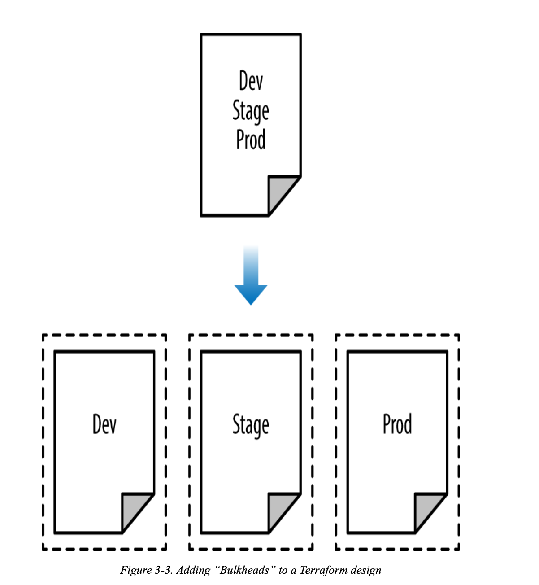
    
    - instead of defining all your environments in a single set of Terraform configurations (top), 
      you want to define each environment in a separate set of configurations (bottom), so a problem 
      in one environment is completely isolated from the others.
    
    - Isolation Types :

    1- Isolation via workspaces
        Useful for quick, isolated tests on the same configuration.
    
    2- Isolation via file layout
        Useful for production use cases for which you need strong separation between environments.
        
    1- Isolation via workspaces :
    $ run `terraform workspace show`
        default

    - when we don't specify a workspace for state file we already using default one.
    
    - Create a new workspace :
    $ terraform workspace new example1
    
    Terraform wants to create a totally new EC2 Instance from scratch! That’s because the state files in each workspace 
    are isolated from one another, and because you’re now in the example1 workspace, Terraform isn’t using the state file from the default workspace, 
    and therefore, doesn’t see the EC2 Instance was already created there.

    - terraform apply # to create resources
    
    + to list all workspaces :

    $ terraform workspace list

    ++ And you can switch between them at any time using the `terraform workspace select` command.

    --> To understand how this works under the hood, take a look again in your S3 bucket; you should now see a new folder called env:
    --> Inside the env: folder, you’ll find one folder for each of your workspaces
    
    ++ Very Important :

    Inside each of those workspaces, Terraform uses the key you specified in your backend configuration, so you should find an
    example1/workspaces-example/terraform.tfstate and an example2/workspaces-example/terraform.tfstate. In other words, switching to a 
    different workspace is equivalent to changing the path where your state file is stored.
    
    ```
        terraform {
            backend "s3" {
            # Replace this with your bucket name!
            bucket         = "terraform-up-and-running-state"
            key            = "workspaces-example/terraform.tfstate" #default one
            --------------------------------------
            for example1 --> example1/workspaces-example/terraform.tfstate
    ```
    
    - The Purpose of using workspaces :

    This is handy when you already have a Terraform module deployed, and you want to do some experiments with it (e.g., try to refactor the code), 
    but you don’t want your experiments to affect the state of the already deployed infrastructure. Terraform workspaces allow you to run terraform 
    workspace new and deploy a new copy of the exact same infrastructure, but storing the state in a separate file.
    
    In fact, you can even change how that module behaves based on the workspace you’re in by reading the workspace name using the expression terraform.workspace. 
    For example, here’s how to set the Instance type to t2.medium in the default workspace and t2.micro in all other workspaces 

    ```
        resource "aws_instance" "example" {
            ami = "ami-0c55b159cbfafe1f0" 
            instance_type = terraform.workspace == "default" ? "t2.medium" : "t2.micro"
        }
    ```

    NB: workspace startegy to isolate environments is not recommended in production uses instead you can use `file_layout`.
    
    2- Isolation via File Layout :

    To acheive full isolation between environments, you need to do the following:
    Put the Terraform configuration files for each environment into a separate folder. For example, all of the configurations for the staging environment 
    can be in a folder called stage and all the configurations for the production environment can be in a folder called prod.
    Configure a different backend for each environment, using different authentication mechanisms and access controls (e.g., each environment 
    could live in a separate AWS account with a separate S3 bucket as a backend).
        
    -- > With this approach, the use of separate folders makes it much clearer which environments you’re deploying to, and the use of separate state files, 
         with separate authentication mechanisms, makes it significantly less likely that a screw up in one environment can have any impact on another.

    - Isolation in Component level :

    In fact, you might want to take the isolation concept beyond environments and down to the “component” level, where a component is a coherent set of resources that you typically deploy together. 
    For example, after you’ve set up the basic network topology for your infrastructure—in AWS lingo, your Virtual Private Cloud
    (VPC) and all the associated subnets, routing rules, VPNs, and network ACLs—you will probably change it only once every few months, at most. On the other hand, you might deploy a new version of a web server 
    multiple times per day. If you manage the infrastructure for both the VPC component and the web server component in the same set of Terraform configurations, you are unnecessarily putting your entire network 
    topology at risk of breakage (e.g., from a simple typo in the code or someone accidentally running the wrong command) multiple times per day.

    solution : Therefore, I recommend using separate Terraform folders (and therefore separate state files) for each environment (staging, production, etc.) and for each component (VPC, services, databases).

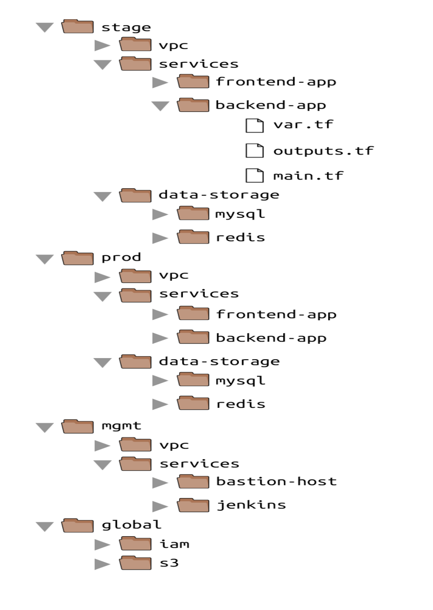

    At the top level, there are separate folders for each “environment.” The exact environments differ for every project, but the typical ones are as follows:
    stage
    An environment for preproduction workloads (i.e., testing)
    prod
    An environment for production workloads (i.e., user-facing apps)
    mgmt
    An environment for DevOps tooling (e.g., bastion host, Jenkins)
    global
    
    A place to put resources that are used across all environments (e.g., S3, IAM)
    Within each environment, there are separate folders for each “component.” The components differ for every project, but here are the typical ones:
    
    vpc
    The network topology for this environment.
    services
    The apps or microservices to run in this environment, such as a Ruby on Rails frontend or a Scala backend. Each app could even live in its own folder to isolate it from all the other apps.
    data-storage
    The data stores to run in this environment, such as MySQL or Redis. Each data store could even reside in its own folder to isolate it from all other data stores.

    ++ AVOIDING COPY/PASTE
    The file layout described in this section has a lot of duplication. For example, the same frontend-app and backend-app live in both the stage and prod folders. Don’t worry, you won’t need to copy and paste all of that code! In Chapter 4, 
    you’ll see how to use Terraform modules to keep all of this code DRY.

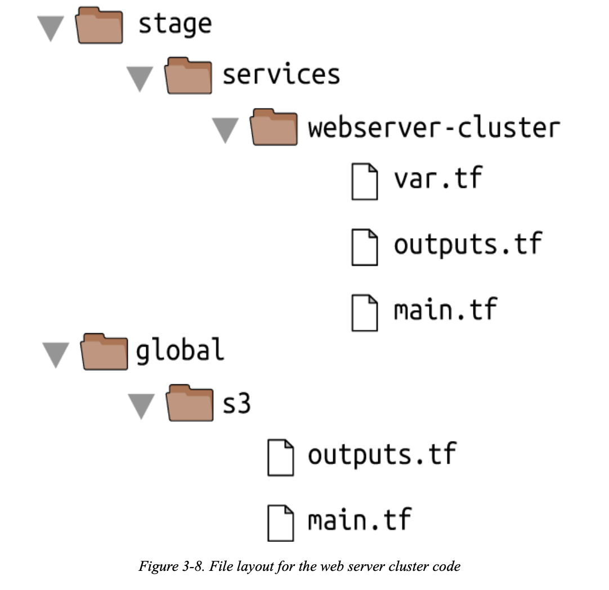

    - Problems of file-layout :

    There is another problem with this file layout: it makes it more difficult to use resource dependencies. If your app code was defined in the same Terraform configuration files as the database code, 
    that app could directly access attributes of the database using an attribute reference (e.g., access the database address via aws_db_instance.foo.address). But if the app code and database code live 
    in different folders, as I’ve recommended, you can no longer do that. Fortunately, Terraform offers a solution: the terraform_remote_state data source.
    
    1- The terraform_remote_state Data Source
    In Chapter 2, you used data sources to fetch read-only information from AWS, such as the aws_subnet_ids data source, which returns a list of subnets in your VPC. There is another data source that is particularly useful 
    when working with state: terraform_remote_state. You can use this data source to fetch the Terraform state file stored by another set of Terraform configurations in a completely read-only manner.
    Let’s go through an example. Imagine that your web server cluster needs to communicate with a MySQL database. Running a database that is scalable, secure, durable, and highly available is a lot of work.
     
    Again, you can let AWS take care of it for you, this time by using Amazon’s Relational Database Service (RDS), as shown in Figure 3- 9. RDS supports a variety of databases, including MySQL, PostgreSQL, SQL Server, and Oracle.

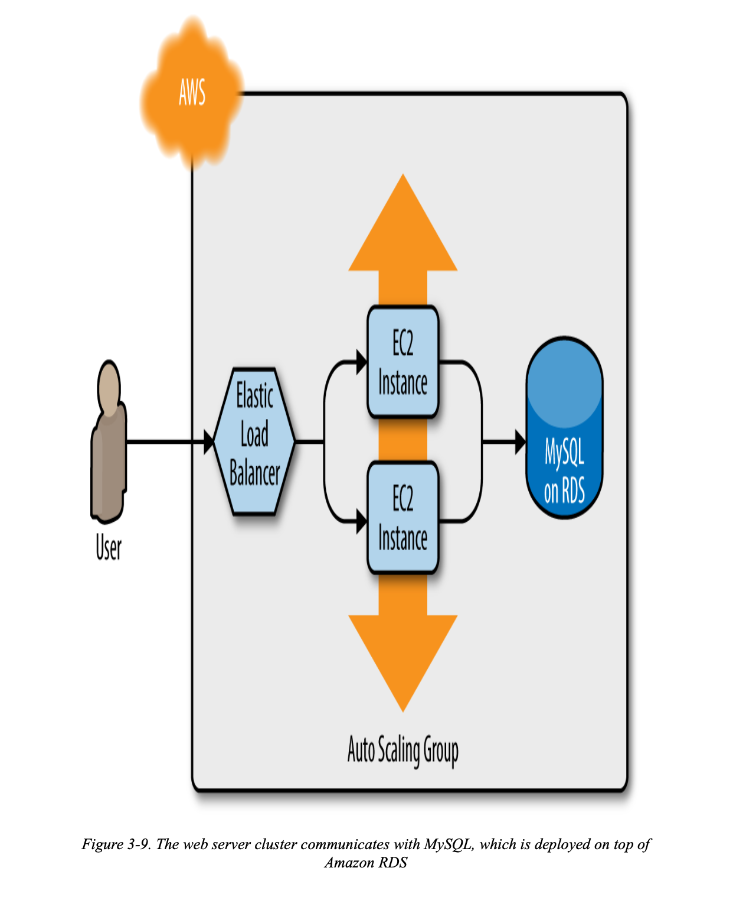

    - Very Important :

    You might not want to define the MySQL database in the same set of configuration files as the web server cluster, because you’ll be deploying updates to the web server cluster far more frequently and don’t want to risk accidentally breaking the database each time you do so. 
    Therefore, your first step should be to create a new folder at stage/data-stores/mysql
    
    - code to create mysql db at Amazon RDS :

    ```
        provider "aws" {
            region = "us-east-2"
        }

        resource "aws_db_instance" "example" {
          identifier_prefix = "terraform-example"
          engine = "mysql"
          allocated_storage = 10 # 10 GB
          instance_class = "db.t2.micro" # 1 CPU instance
          name = "example_database"
          username = "admin"
        
          # How we should set password
          password = "???"
        }
    ```
    2- Handling Secrets :
    
    - One option for handling secrets is to use a Terraform data source to read the secrets from a secret store. 
      For example, you can store secrets, such as database passwords, in AWS Secrets Manager, which is a managed service   
      AWS offers specifically for storing sensitive data. You could use the AWS Secrets Manager UI to store the secret and then 
      read the secret back out in your Terraform code using the aws_secretsmanager_secret_version data source:
    
    - create data_source access for secrets in aws :
        
    ```
        data "aws_secretsmanager_secret_version" "db_password" {
            secret_id = "mysql-master-password-stage"
        }
    ```
    
    - replace `password = "???"` with password = data.aws_secretsmanager_secret_version.db_password.secret_string
    ++ and set `db_password` secret in aws secret manager.

    Or you can use `variables` for `db_password` without giving the default one 
    
    ```
        variable "db_password" {
            description = "The password for the database" 
            type = string
        }
    ```
    
    Note that this variable does not have a default. This is intentional. You should not store your database password or any sensitive
    information in plain text. Instead, you’ll set this variable using an environment variable.
    As a reminder, for each input variable foo defined in your Terraform configurations, you can provide Terraform the value of this variable 
    using the environment variable TF_VAR_foo. For the db_password input variable, here is how you can set the TF_VAR_db_password environment variable on Linux/Unix/OS X systems:
    
    Very Important : NOTE

    ```
         export TF_VAR_db_password="(YOUR_DB_PASSWORD)"  # Note that there is intentionally a space before the export command to prevent the secret from being stored on disk in your Bash history.
        $ terraform apply
    ```
    
    - Super Important Security Weakness in Terraform :

    - SECRETS ARE ALWAYS STORED IN TERRAFORM STATE
    Reading secrets from a secrets store or environment variables is a good practice to ensure secrets aren’t stored in plain text in your code, but just a reminder: no matter how you read in the secret, if you pass it as an argument to a Terraform resource, such as aws_db_instance, 
    that secret will be stored in the Terraform state file, in plain text.
    This is a known weakness of Terraform, with no effective solutions available, so be extra paranoid with how you store your state files (e.g., always enable encryption) and who can access those state files (e.g., use IAM permissions to lock down access to your S3 bucket)!
    
    ++ Secure access to the s3 buckets.

    - Now to migrate state file of the mysql folder add this code :

    ```
        terraform {
          backend "s3" {
        
            bucket         = "terraform-remote-state-example-test"
            key            = "stage/data-stores/mysql/terraform.tfstate"
            region         = "us-east-2"
            # Replace this with your DynamoDB table name!
            dynamodb_table = "terraform-locks-example-test"
            encrypt = true
          }
        }
    ```

    Now that you have a database, how do you provide its address and port to your web server cluster? The first step is to add two output variables to stage/data-stores/mysql/outputs.tf:
    
    output "address" {
      value       = aws_db_instance.example.address
      description = "Connect to the database at this endpoint"
    }
    
    output "port" {
      value       = aws_db_instance.example.port
      description = "The port the database is listening on"
    }
    
    - run $ terraform apply
    
    Outputs:

    address = "terraform-example20211025151148456400000001.ccsazawrysf8.us-east-2.rds.amazonaws.com"
    port = 3306

    ++ These outputs are now also stored in the Terraform state for the database, which is in your S3 bucket at the path stage/data- stores/mysql/terraform.tfstate. 
        You can get the web server cluster code to read the data from this state file by adding the terraform_remote_state data source in stage/services/webserver-cluster/main.tf:

    ```
        data "terraform_remote_state" "db" {
          backend = "s3"
          config = {
            bucket = "(YOUR_BUCKET_NAME)"
            key    = "stage/data-stores/mysql/terraform.tfstate"
            region = "us-east-2"
            } 
        }
    ```

    This `terraform_remote_state` data source configures the web server cluster code to read the state file from the same S3 bucket and folder where the database stores its state, AS SHOWN ABOVE :
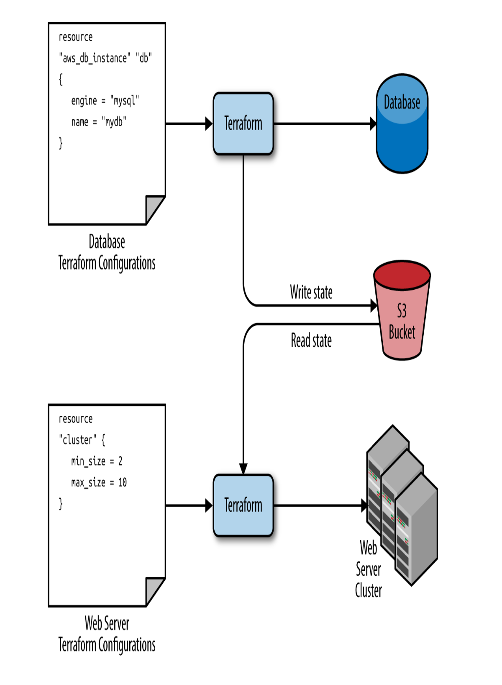

    - IF you have problem acquiring lock you can investigate and check processes currently running that clock acquiring one :

    + run $ ps aux | grep terraform
    + sudo kill -9 <process_id>

    or use arg `-lock=false`

    terraform apply -lock=false (it's not recommended)

    - Read Amazon RDS remote_state_file attributes :
    All of the database’s output variables are stored in the state file and you can read them from the terraform_remote_state data source using an attribute reference of the form:
    -> data.terraform_remote_state.<NAME>.outputs.<ATTRIBUTE>

    - For example, here is how you can update the User Data of the web server cluster Instances to pull the database address and port out of the terraform_remote_state data source and expose that information in the HTTP response:
    ```
        user_data = <<EOF
        #!/bin/bash
        echo "Hello, World" >> index.html
        echo "${data.terraform_remote_state.db.outputs.address}" >> index.html
        echo "${data.terraform_remote_state.db.outputs.port}" >> index.html
        nohup busybox httpd -f -p ${var.server_port} &
        EOF
    ```

    - second step is to create template with that bash script :

    ```
    data "template_file" "user_data" {
        template = file("user-data.sh")
    
          vars = {
            server_port = var.server_port
            db_address  = data.terraform_remote_state.db.outputs.address
            db_port     = data.terraform_remote_state.db.outputs.port
          }
    }
    ```

    and finally just add user_data field to aws_laucnh_configurationas following :

    user_data = data.template_file.user_data.rendered
    
    
    - you can this script for testing purposes :
    
    ```
        #!/bin/bash

        export db_address=12.34.56.78
        export db_port=5555
        export server_port=8080
        
        chmod u+x ./user-data.sh
        
        output=$(curl "http://localhost:$server_port")
        
        if [[ $output == *"Hello, World"* ]]; then
          echo "Success! Got expected text from server."
        else
          echo "Error. Did not get back expected text 'Hello, World'."
        fi
    ```
    
    run $ bash  bash_unit_test.sh

    - There is a helpful tool called `console` you can use it to debug you code get a variable value:
    
    $ terraform console (it work with isolation so have only one terraform.tfstate that you could use to get values.)

## Chapter 4 : How to create reusable infrastructure using terraform modules :

    - Staging/Production Environments :

    This works great as a first environment, but you typically need at least two environments: one for your team’s internal testing (“staging”) and one that real users can access (“production”), 
    the two environments are nearly identical, though you might run slightly fewer/smaller servers in staging to save money.

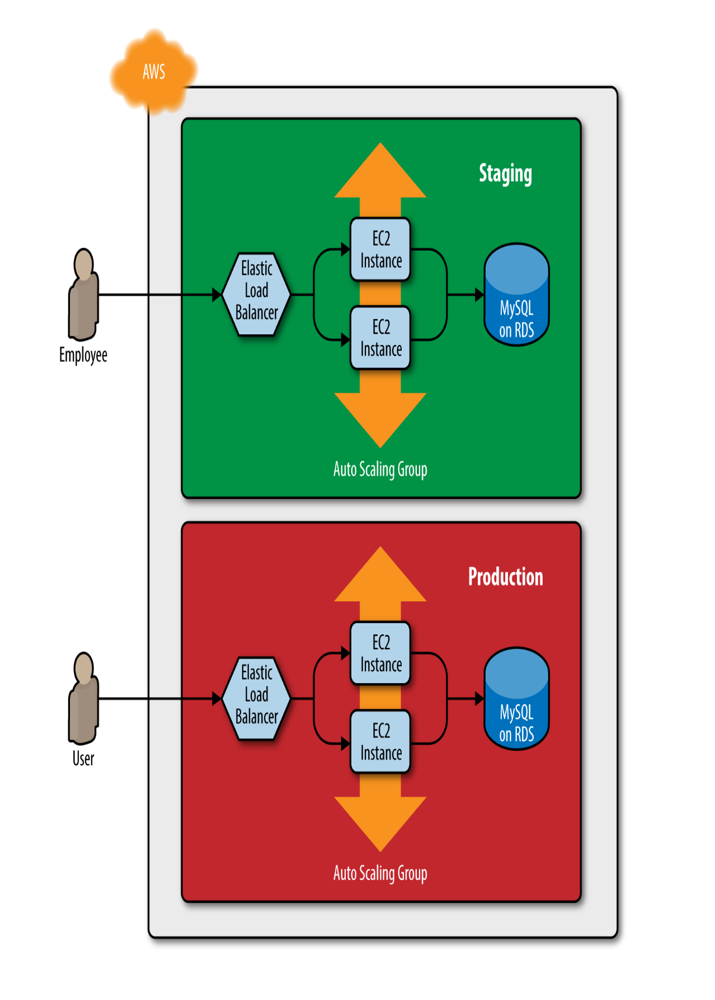

    - Problem - How to Avoid Copy/Paste code from staging folder to prod one :

    How do you add this production environment without having to copy and paste all of the code from staging? For example, how do you avoid having to copy and paste all the code in 
    stage/services/webserver-cluster into prod/services/webserver-cluster and all the code in stage/data-stores/mysql into prod/data- stores/mysql?

    ++ In a general-purpose programming language such as Ruby, if you had the same code copied and pasted in several places, you could put that code inside of a function and reuse that function everywhere.

    - Solution - Terraform Modules :    

    --> With Terraform, you can put your code inside of a Terraform module and reuse that module in multiple places throughout your code.

    +++ Instead of having the same code copied and pasted in the staging and production environments, you’ll be able to have both environments reuse code from the same module
    
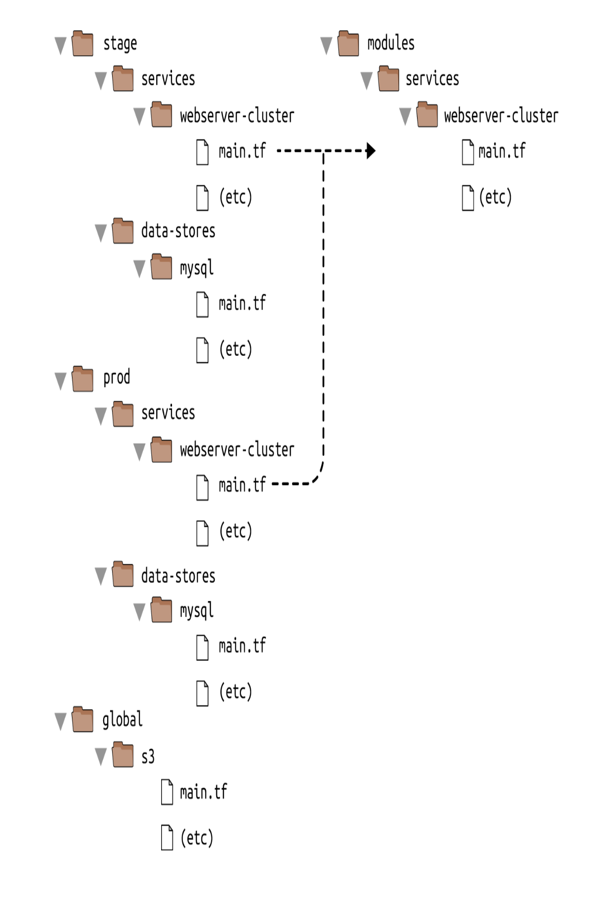

    - Finally :

    This is a big deal. Modules are the key ingredient to writing reusable, maintainable, and testable Terraform code. Once you start using them, there’s no going back. You’ll start building everything as a module, 
    creating a library of modules to share within your company, using modules that you find online, and thinking of your entire infrastructure as a collection of reusable modules.

    1- Module Basics :

    + As an example, let’s turn the code in stage/services/webserver-cluster, which includes an Auto Scaling Group (ASG), Application Load Balancer (ALB), security groups, and many other resources, into a reusable module.

    1-1 First step is to move files under stage/services/webserver-cluster to modules/services/webserver-cluster
    1-2 Open up the main.tf file in modules/services/webserver-cluster and remove the provider definition. Providers should be configured by the user of the module and not by the module itself.

    - You can now make use of this module in the staging environment. Here’s the syntax for using a module:

    ```
        # Calling the same code but from another module :
        provider "aws" {
          region = "us-east-2"
        }
        
        module "webserver-cluster" {
          source = "../../../../modules/services/webserver-cluster"
        }
    ```

    NB: Note that whenever you add a module to your Terraform configurations or modify the source parameter of a module, 
        you need to run the init command before you run plan or apply.

    - Problem - Avoid using hardcoded component names :

    Before you run the apply command on this code, be aware that there is a problem with the webserver-cluster module: all of
    the names are hardcoded. That is, the name of the security groups, ALB, and other resources are all hardcoded, 
    so if you use this module more than once, you’ll get name conflict errors. Even the database details are hardcoded because 
    the main.tf file you copied into modules/services/webserver-cluster is using a terraform_remote_state data source to figure out the
    database address and port, and that terraform_remote_state is hardcoded to look at the staging environment.
    To fix these issues, you need to add configurable inputs to the webserver-cluster module so that it can behave differently in different environments.

    2- Module Inputs :
    
    - Create those Input variables :
    
    ```
    variable "cluster_name" {
      description = "The name to use for all the cluster resources"
      type = string
    }

    variable "db_remote_state_bucket" {
      description = "The name of the S3 bucket for the database's remote state"
      type = string
    }
    
    variable "db_remote_state_key" {
      description = "The path for the database's remote state in S3"
      type = string
    }
    ```

    + Change those variables in main.tf (module) :

    ```
        resource "aws_security_group" "alb" { 
            name = "${var.cluster_name}-alb"
            .....

        
    ```

    + You’ll need to make a similar change to the other aws_security_group resource (e.g., give it the name "${var.cluster_name}-instance"), 
    the aws_alb resource, and the tag section of the aws_autoscaling_group resource.    

    --> You should also update the terraform_remote_state data source to use the db_remote_state_bucket and db_remote_state_key as its bucket and key parameter, respectively

    
    ```
        data "terraform_remote_state" "db" {
          backend = "s3"
            config = {
                bucket = var.db_remote_state_bucket
                key    = var.db_remote_state_key
                region = "us-east-2"
              }
        }
    ```

    +++ Now to set those variables in prod environment you can include them in module calling func :

    ```
        module "webserver-cluster" {
          source = "../../../../modules/services/webserver-cluster"
          cluster_name = "webservers-prod"
          db_remote_state_bucket = "prod-cluster-s3-bucket"
          db_remote_state_key = "prod/data-stores/mysql/terraform.tfstate"
        }
    ```

    + Among those variables we can add more inputs to configure our infrastructure :
    
    ++  in staging, you might want to run a small web server cluster to save money, but in production, 
        you might want to run a larger cluster to handle lots of traffic. 


    3- Module Locals :

    Using input variables to define your module’s inputs is great, but what if you need a way to define a variable 
    in your module to do some intermediary calculation, or just to keep your code DRY, but you don’t want to expose 
    that variable as a configurable input? For example, the load balancer in the webserver-cluster module in modules/services/webserver-cluster/main.tf 
    listens on port 80, the default port for HTTP. This port number is currently copied and pasted in multiple places.

    in this case we will use `Locals` :
    
    ```
        locals {
          http_port    = 80
          any_port     = 0
          any_protocol = "-1"
          tcp_protocol = "tcp"
          all_ips      = ["0.0.0.0/0"]
        }
    ```

    to call a local use this syntax -> local.<NAME>

    4- Module Outputs :

    A powerful feature of ASGs is that you can configure them to increase or decrease the number of servers you have running in response to load. 
    One way to do this is to use a scheduled action, which can change the size of the cluster at a scheduled time during the day. 
    For example, if traffic to your cluster is much higher during normal business hours, you can use a scheduled action to increase the number of servers at 9 a.m. and decrease it at 5 p.m.
    
    + to Schedule Scaling out/in only in prod environment use `aws_autoschedule_action` resource as code below :

    ```
        resource "aws_autoscaling_schedule" "scale_out_during_business_hours" {
          scheduled_action_name  = "scale-out-during-business-hours"
          min_size = 2
          max_size = 10
          desired_capacity = 10
          recurrence = "0 9 * * *" # cron job code means 9 am everyday
        }

        resource "aws_autoscaling_schedule" "scale_in_at_night" {
          scheduled_action_name  = "scale-oin-at-night"
          min_size = 2
          max_size = 10
          desired_capacity = 2
          recurrence = "0 17 * * *" # cron job code means 5 pm everyday
        }
    ```

    +++ However, both usages of aws_autoscaling_schedule are missing a required parameter, autoscaling_group_name, which specifies the name of the ASG. 
        The ASG itself is defined within the webserver-cluster module.
    
    - To create asg name output variable use this code in the module :

        output "asg_name" {
          value = aws_autoscaling_group.example.name
          description = "Auto scaling group's name"
        }
    
    - To access this variable from prod env :

    -> module.<MODULE_NAME>.<OUTPUT_NAME>
    
    For out case add this arg : `autoscaling_group_name = module.webserver-cluster.asg_name`

    5- Module Gotachs
    
    5-1 File Path :
    
    File path is a feature in terraform to get the relative path to a script or a module in reference to module, root, or cwd (current working directory)
    
    Terraform supports the following types of path references:
    
    path.module
    Returns the filesystem path of the module where the expression is defined.
    
    path.root
    Returns the filesystem path of the root module.
    
    path.cwd
    Returns the filesystem path of the current working directory. In normal use of Terraform this is the same as path.root, but
    
    for example for template of user_data bash script we want to have a path related to module this is why the code should be like :

    ```
        data "template_file" "user_data" {
          template = file("${path.module}/user-data.sh")
        
          vars = {
            server_port = var.server_port
            db_address  = data.terraform_remote_state.db.outputs.address
            db_port     = data.terraform_remote_state.db.outputs.port
          }
        }
    ```

    5-2 Inline Blocks :

    The configuration for some Terraform resources can be defined either as inline blocks or as separate resources. When creating a module, 
    you should always prefer using a separate resource.
    For example, the aws_security_group resource allows you to define ingress and egress rules via inline blocks
    
    - From Inline Blocks    

    ```
        resource "aws_security_group" "alb" {
          name = "${var.cluster_name}-security-alb"
        
          # Allow inbound HTTP requests
          ingress {
            from_port = local.http_port
            protocol  = local.tcp_protocol
            to_port   = local.http_port
            cidr_blocks = local.all_ips # you can use any IP address
          }
        
          # Allow all outbound requests
        
          egress {
            from_port = local.any_port
            protocol  = local.any_protocol
            to_port   = local.any_port
            cidr_blocks = local.all_ips
          }
        
        }
    ```

    - to separate resources :

    ```
    resource "aws_security_group" "alb" { 
        name = "${var.cluster_name}-alb"
    }

    resource "aws_security_group_rule" "allow_http_inbound" { 
        type = "ingress"
        security_group_id = aws_security_group.alb.id
        from_port = local.http_port
        to_port = local.http_port
        protocol = local.tcp_protocol
        cidr_blocks = local.all_ips
    }

    resource "aws_security_group_rule" "allow_all_outbound" { 
        type = "egress"
        security_group_id = aws_security_group.alb.id
        from_port = local.any_port
        to_port = local.any_port
        protocol = local.any_protocol
        cidr_blocks = local.all_ips
    }

    ```

    NB: If you try to use a mix of both inline blocks and separate resources, you will get errors where routing rules conflict and overwrite one another. 
        Therefore, you must use one or the other. Because of this limitation, when creating a module, you should always try to use a separate resource instead of the inline block.
        Otherwise, your module will be less flexible and configurable.

    
    - Add Custom Rules :

    For example, if all the ingress and egress rules within the webserver-cluster module are defined as separate aws_security_group_rule resources, you can make the module flexible enough to allow users to add custom rules from outside the module. 
    To do that, you export the ID of the aws_security_group as an output variable in   
    
    # Module level
    ```
        output "alb_security_group_id" {
            value = aws_security_group.alb.id
            description = "The ID of the Security Group attached to the load balancer"
    }
    ```

    ```
        resource "aws_security_group" "allow_testing_inbound" {
              type = ingress
              security_group_id = module.webserver-cluster.alb_security_group_id
              from_port = 12345
              to_port = 12345
              protocol = "tcp"
              cidr_blocks = ["0.0.0.0/0"]
        }
    ```

    NB: you could not define security_group_rules in `inline block` way, your code should be consistent all separate or all inline blocks.

    +++ Network Isolation :

    The examples in this chapter create two environments that are isolated in your Terraform code, as well as isolated in terms of having separate load balancers, 
    servers, and databases, but they are not isolated at the network level. To keep all the examples in this book simple, all of the resources deploy into the same 
    Virtual Private Cloud (VPC). This means that a server in the staging environment can communicate with a server in the production environment, and vice versa.    
    
    In real-world usage, running both environments in one VPC opens you up to two risks. First, a mistake in one environment could affect the other. For example, if you’re making changes in staging and accidentally mess up the configuration of the route tables, 
    all the routing in production can be affected, too. Second, if an attacker gains access to one environment, they also have access to the other. If you’re making rapid changes in staging and accidentally leave a port exposed, any hacker that broke in 
    would not only have access to your staging data, but also your production data.
    Therefore, outside of simple examples and experiments, you should run each environment in a separate VPC. In fact, to be extra sure, you might even run each environment in totally separate AWS accounts.

    6- Module Versionning :

     - you can use github to host your modules and call them later on your current infra code :

    ++  In all of the module examples you’ve seen so far, whenever you used a module, you set the source parameter of the module to a local file path. In addition to file paths, 
        Terraform supports other types of module sources, such as Git URLs, Mercurial URLs, and arbitrary HTTP URLs.1 The easiest way to create a versioned module is to put the code for the module in a separate Git repository and to set the source parameter to that repository’s URL. That means your Terraform code will be spread out across (at least) two repositories:
        
        modules
        This repo defines reusable modules. Think of each module as a “blueprint” that defines a specific part of your infrastructure.
        live
        This repo defines the live infrastructure you’re running in each environment (stage, prod, mgmt, etc.). Think of this as the “houses” you built from the “blueprints” in the modules repo.

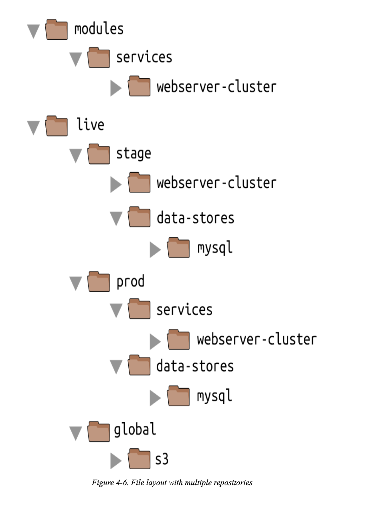

    - First step is to create a repo called `foo` e.g and push modules folder to this repo 

    ++ here is the commands to tag your first version :
    
    $ git tag -a "v0.0.1" -m "First release of webserver-cluster module"
    $ git push --follow-tags
    
    ++ git push --follow-tags :
    That won't push all the local tags though, only the one referenced by commits which are pushed with the git push.    
    
    - Example of second release tag :
    
    $ git tag -a "v0.0.2" -m "Second release of webserver-cluster"
    -> source = "git@github.com:foo/modules.git//webserver-cluster?ref=v0.0.2

    - second step is to import module from your git repo :    

    +++ Release Process :

    After v0.0.2 has been thoroughly tested and proven in staging, you can then update production, too. But if there turns out to be a bug in v0.0.2, 
    no big deal, because it has no effect on the real users of your production environment. Fix the bug, release a new version, and repeat the entire 
    process again until you have something stable enough for production.
    
    ++ Semantic Versionning :

    - MAJOR version when you make incompatible API changes,
    - MINOR version when you add functionality in a backward-compatible manner
    - PATCH version when you make backward-compatible bug fixes.

    ```
        module "webserver_cluster" {
            source = "github.com/foo/modules//webserver-cluster?ref=v0.0.1" # the double slash is required
            cluster_name = "webservers-stage"
            .....
    ```

    - PRIVATE GIT REPOS
    If your Terraform module is in a private Git repository, to use that repo as a module source, you need to give Terraform a way to authenticate to that Git repository. 
    I recommend using SSH auth so that you don’t need to hardcode the credentials for your repo in the code itself. With SSH authentication, each developer can create an SSH key, 
    associate it with their Git user, and add it to ssh-agent, and Terraform will automatically use that key for authentication if you use an SSH source URL.2

    - Right now you can .. :

    For example, you could create a canonical module that defines how to deploy a single microservice—including how to run a cluster, 
    how to scale the cluster in response to load, and how to distribute traffic requests across the cluster—and each team could use 
    this module to manage their own microservices with just a few lines of code.

## Chapter 5. Terraform Tips and Tricks: Loops, If- Statements, Deployment, and Gotchas :

    + Terradorm Syntax For loops, if-statements others .. :

    1- Loops :
    Terraform offers several different looping constructs, each intended to be used in a slightly different scenario:
    
    - count parameter, to loop over resources
    - for_each expressions, to loop over resources and inline blocks within a resource
    - for expressions, to loop over lists and maps
    - for string directive, to loop over lists and maps within a string

    ++ What if you want to create three IAM users? 

    ```
        for (i = 0; i < 3; i++) {
            resource "aws_iam_user" "example" { 
                name = "neo"
            } 
        }
    ```

    ++ The example above won't work instead you can use `count` :

    ```
        resource "aws_iam_user" "example" { 
            count = 3
            name = "neo"
        }
    ```

    One problem with this code is that all three IAM users would have the same name, which would cause an error, since usernames must be unique. 
    If you had access to a standard for-loop, you might use the index in the for-loop, i, to give each user a unique name:

    ```
        # This is just pseudo code. It won't actually work in Terraform.
        for (i = 0; i < 3; i++) {
            resource "aws_iam_user" "example" { 
                name = "neo.${i}"
            } 
        }
    ```

    To accomplish the same thing in Terraform, you can use count.index to get the index of each “iteration” in the “loop”:

    ```
        resource "aws_iam_user" "example" { 
            count = 3
            name = "neo.${count.index}"
        }
    ```

    ++ You can customize more names of  each user by creating a variable :

    ```
        variable "user_names" {
            description = "Create IAM users with these names" 
            type = list(string)
            default = ["neo", "trinity", "morpheus"]
        }
    ```
    
    ```
        resource "aws_iam_user" "example" { 
            count = length(vars.user_names)
            name = vars.user_names[count.index]
        }
    ```

    ++ if you want for example to get arn of an iam user :

    ```
        output "neo_arn" {
            value       = aws_iam_user.example[0].arn
            description = "The ARN for user Neo"
        }
    ```

    - and if you want to show arn for all iam users use star `*`:
    
    ```
        output "neo_arn" {
            value       = aws_iam_user.example[*].arn
            description = "The ARNs for all users"
        }
    ```

    ++ `COUNT` Limitations :

    - although you can use count to loop over an entire resource, you can’t use count within a resource to loop over inline blocks.

    2- Loops with for_each Expressions :
    - The for_each expression allows you to loop over lists, sets, and maps to create either (a) multiple copies of an entire resource, or (b) multiple copies of an inline block within a resource.

    - Expression to create 3 iam_users using variable that containt a list of 3 names :

    ```
    resource "aws_iam_user" "example" { 
        for_each = toset(var.user_names) 
        name = each.value
    }
    ```
    
    - to output all values of each iam_user :
    
    ```
        output "all_users" {
            value = aws_iam_user.example
        }
    ```

    ++ Result :
    
    ```
        all_users = {
              "morpheus" = {
                "arn" = "arn:aws:iam::123456789012:user/morpheus"
                "force_destroy" = false
                "id" = "morpheus"
                "name" = "morpheus"
            "path" = "/"
            "tags" = {} }
              "neo" = {
                "arn" = "arn:aws:iam::123456789012:user/neo"
                "force_destroy" = false
                "id" = "neo"
                "name" = "neo"
                "path" = "/"
                "tags" = {}
              }
              "trinity" = {
                "arn" = "arn:aws:iam::123456789012:user/trinity"
                "force_destroy" = false
                "id" = "trinity"
                "name" = "trinity"
                "path" = "/"
                "tags" = {}
                ...
    ```

    ++ to output only arn of all iam_users :

    ```
        output "all_arns" {
            value = values(aws_iam_user.example)[*].arn
        }
    ```

    NB: it's better to use `foreach` than `count` cuz if you want to delete a resource in `count` for example trinity
        the list of iam_users will shift by one place and terraform apply command will create all resources the opposite of 
        `foreach` when deleting an iam_user is name, it will delete only that user.

    3- Zero-Downtime Deployment :

    + how do you deploy a new Amazon Machine Image (AMI) across the cluster? 
      And how do you do it without causing downtime for your users?

    - The example below show how we can change user_data text for ami intances with zero-downtime :
    
    - first we need to make server_text dynamic with changing text :

    ```
        variable "ami" {
          description = "image id of the ami used for webservers"
          default = "ami-0c55b159cbfafe1f0"
          type = string
        }

        variable "server_text" {
          description = "the text webserver should return"
          default = "Hello, world"
          type = string
        }
    ```

    - second step is to update ASG aka aws_autoscaling_group config as following :

    
    resource "aws_autoscaling_group" "example" {
        ....
      name = "${var.cluster_name}-${aws_launch_configuration.example.name}"
      min_elb_capacity = var.min_size  # we should make sure that minumum 2 ec2 instances are created and healthy before destroying
    
      lifecycle {
            create_before_destroy = true # zero downtime # we should create ec2 instances before detroying old ones
      }
        ....
    }

    - finally to test changes with new `server_text` :

    $ while true; do curl http://<load_balancer_url>; sleep 1;

    ## If something went wrong :

    ++ if something went wrong during the deployment, Terraform will automatically roll back. For example, if there were a bug in v2 of your app and it failed to boot, 
       the Instances in the new ASG will not register with the ALB. Terraform will wait up to wait_for_capacity_timeout (default is 10 minutes) for min_elb_capacity servers 
       of the v2 ASG to register in the ALB, after which it considers the deployment a failure, deletes the v2 ASG, and exits with an error (meanwhile, v1 of your app continues to run just fine in the original ASG).

    + Terraform Gotchas :

    1- count and for_each limitations :

    YOU CANNOT USE COUNT OR FOR_EACH WITHIN A MODULE CONFIGURATION
    Something that you might be tempted to try is to use the count parameter within a module configuration:
    
    module "count_example" {
        source = "../../../../modules/services/webserver-cluster"
        count = 3
        cluster_name  = "terraform-up-and-running-example"
        server_port   = 8080
        ...
    }

    ### NB: Zero-Downtime Deployment Has Limitations :
    Using create_before_destroy with an ASG is a great technique for zero-downtime deployment, but there is one limitation: it doesn’t work with auto scaling policies. Or, to be more accurate, it resets your ASG size back to its min_size after each deployment, 
    which can be a problem if you had used auto scaling policies to increase the number of running servers.

    For example, the webserver-cluster module includes a couple of aws_autoscaling_schedule resources that increase the
    number of servers in the cluster from 2 to 10 at 9 a.m. If you ran a deployment at, say, 11 a.m., the replacement ASG would boot up with only 2 servers, rather than 10, and it would stay that way until 9 a.m. the next day.